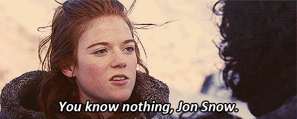
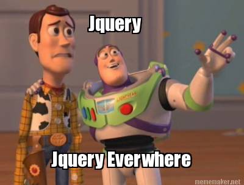
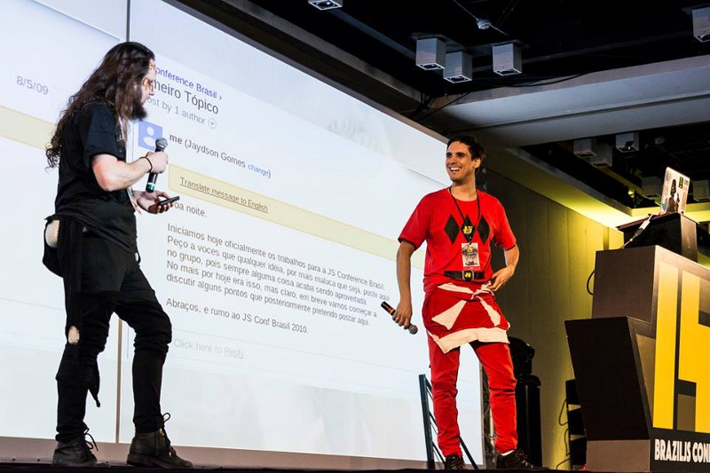

Há 9 meses atrás escrevi um [post semelhante falando sobre a faculdade](https://medium.com/@viniciusdacal/se-eu-soubesse-aos-18-faculdade-9ee973342620#.wtxv5x2e4), nele eu prometi escrever um post abordando o tema profissão, e aqui estou, cumprindo com a promessa; Antes tarde do que nunca.

A intensão desse post não é falar nenhuma verdade absoluta ou mostrar um caminho definitivo para o sucesso profissional, e sim, apenas relatar um pouco da experiência que tive nesses quatro anos trabalhando com web, e contribuir com algumas dicas que acredito que teriam sido úteis la no início.

### O início

Em Umuarama-PR, em meados de 2011, cursando o segundo semestre da faculdade, decidi sair do emprego que eu estava para me aventurar a desenvolver websites. Na época, com um conhecimento básico de HTML e CSS, achei que daria conta de vender, desenhar e desenvolver sites, eu só não sabia o péssimo vendedor que eu era.

Resumindo: um mês depois eu estava desesperado atrás de emprego, eu precisava de dinheiro para pagar a faculdade e minhas economias, bem, eu nunca tive economias.

Nessa fase, eu decidi que já que eu não poderia trabalhar por conta própria, eu iria ao menos procurar uma vaga na minha área de estudo, então preparei meu currículo e levei nas empresas que eu conhecia na cidade.

Após um mês de procura, obtive uma resposta da [ADN Múltipla](http://adnmultipla.com), uma agência de publicidade, propaganda e tecnologia.

> _Eu obtive muitos NÃOs antes de obter um SIM, não desanimem._

Ainda hoje, lembro do meu primeiro dia de trabalho (01/09/2011), eu estava super empolgado para saber como era um “Ambiente de desenvolvimento”

A primeira semana não foi fácil, tinha muita coisa nova pra assimilar, e ao mesmo tempo, tinha que saber administrar meu tempo entre faculdade e emprego.

Aos poucos comecei a evoluir no meu trabalho e logo comecei a ver os benefícios de cursar uma faculdade e ao mesmo tempo trabalhar na área. Minha experiência do dia a dia começou a facilitar minha vida dentro da sala de aula, todas aquelas teorias faziam muito mais sentido quando unidas a prática. Ao mesmo tempo, muitas teorias e conceitos aprendidos na faculdade, acabavam me auxiliando no trabalho.

A cada dia eu aprendia mais e mais. Nessa fase eu me sentia o máximo e me achava o super experiente quando o assunto era desenvolvimento web.

### Primeiro Evento

Em novembro de 2011 fiquei sabendo através da faculdade, que teria um evento sobre web dev no Paraná, o [Frontin Londrina](https://twitter.com/hashtag/frontinlondrina). Como eu já conhecia a cidade e tenho familiares lá, decidi ir no evento.

10 de dezembro de 2011, primeiro dia de evento. Auditório lotado, e eu impressionado de ver aquele tanto de gente interessados em web.

Logo na primeira palestra, com o tema “A nova semântica do HTML5”, eu já comecei a ficar perdido, em meio a tantos termos que eu nunca tinha ouvido falar na vida, e foi ai que eu tive aquele MOMENTO! Aquele que você se da conta que você não sabe NADA.

Isso mesmo, NADA, se você ainda não teve esse momento, você ainda terá!

Esse é um dos melhores, mais necessários e esclarecedores momentos da sua vida, é a hora que você se da conta que a única coisa que você sabe, é que você NADA sabe, e que não importa o quanto você estude, sempre haverá algo a ser estudado ou descoberto.

Lembra que eu falei que eu me achava o “super experiente”? Aquela visão que eu tinha, caiu por terra nesta hora.

BTW, O evento foi incrível, tive a oportunidade de conhecer alguns nomes do mundo frontendiano e voltei pra casa com uma infinidade de conteúdo para estudar.

O Frontin Londrina foi crucial para minha carreira, abriu meus olhos para este mundo de comunidade, boas práticas, padrões, Javascript, HTML5, CSS3 e etc.

Gostaria de falar que cheguei em casa no outro dia e criei uma framework que abalou o mundo web. Porem, mesmo com todo esse ânimo e decidido que iria estudar e me especializar nessa área, minha evolução foi a baby steps.

Comecei a aprender Javascript, passei pela fase de ser o programador jQuery, de pesquisar por “jQuery Carousel plugin” no google e me sentir o máximo por conseguir implementar um deles em um site, e continuei assim por um bom tempo.

Nunca parei de procurar conteúdo novo para estudar, mas aos poucos vi que todas as coisas novas que eu estava aprendendo, não se aplicavam ao meu local de trabalho, pelo próprio ritmo de agência.

Logo que terminei a faculdade, julho de 2013, decidi procurar uma vaga pra fora da cidade, onde eu tivesse a oportunidade de desenvolver ainda mais minhas skills.

Encontrei uma vaga em Curitiba, especificamente para Frontend developer, o que em 2013 era um pouco raro se comparado a hoje, e pra trabalhar principalmente com canvas. Pedi demissão, me organizei para mudar e ao mesmo tempo estava me preparando para ir para o meu primeiro BrazilJS.

Indo de ônibus de [Umuarama-PR para Porto Alegre](https://www.google.com.br/maps/dir/Umuarama,+PR/Cascavel+-+PR/Porto+Alegre,+RS/@-26.8292161,-56.9521053,6z/data=!3m1!4b1!4m20!4m19!1m5!1m1!1s0x94f2d6aad88f12b7:0x62e741a44bc7bfc7!2m2!1d-53.3206105!2d-23.7661064!1m5!1m1!1s0x94f17f64f7507c29:0xfa1220399425243c!2m2!1d-53.459544!2d-24.9578832!1m5!1m1!1s0x9519784e88e1007d:0xc7011777424f60bd!2m2!1d-51.2176584!2d-30.0346564!3e0?hl=pt-br)\-RS recebo um e-mail da empresa de Curitiba, me avisando que a contratação havia sido cancelada e que novas contratações só seriam efetuadas no próximo ano. Fiquei um pouco desnorteado, mas ainda estava na animação para o BrazilJS.

### BrazilJS 2013

Sem palavras para descrever o que foi participar [desse evento](https://www.youtube.com/watch?v=93Awzbla0yc&list=PLg2lQYZDBwOSyKzM1_nH-jrBGnwjG6JDt), mais um marco histórico para mim. Aprender que Javascript ia MUITO ALÉM do que eu conseguia imaginar e que sim, havia vida pós jQuery.

Após o evento, acabei indo para Curitiba, já que eu tinha combinado de ficar no meu tio por um tempo e eu estava sem emprego anyway.

A história se repete, novamente começo a procurar vagas, enviar currículos e esperar respostas. O tempo foi passando, o desespero do desemprego aumentando e eu mandando currículos a torto e a direita.

Dessa vez, infelizmente, o destino foi desfavorável, não obtive respostas e acabei voltando para Umuarama, com aquele sentimento de incapacidade e derrota.

Um tempo depois recebi três propostas, uma para trabalhar com JAVA outra com PHP(Magento) e outra como “Fullstack” (com foco em Frontend), na mesma agência que eu trabalhava antes.

Mesmo as propostas salariais de Java e Magento sendo melhores, eu optei pela experiência de continuar trabalhando com Frontend, e no fim acabei voltando para meu antigo emprego.

O tempo passou mais uma vez e muito do que eu estudava eu ainda não conseguia aplicar no trabalho. Nesse meio tempo, aproveitei para evoluir minhas skills de web designer, que mesmo ainda não sendo meu forte me ajudam quando preciso.

### BrazilJS 2014

Consegui participar novamente no ano de 2014 e mais uma vez foi um [evento incrível](https://www.youtube.com/watch?v=AgZJQT1-ixg&list=PLg2lQYZDBwORBD0dC7hCtwpVkIuMx573N) e inesquecível e me lembrou de como eu tinha vontade de me aprofundar no mundo do desenvolvimento web e me especializar cada dia mais.

Deixei as coisas seguirem seu fluxo natural, continuei trabalhando, estudando e aos poucos foram surgindo algumas oportunidades.

Em uma palestra que fui assistir na [Faculdade Alfa](http://www.alfaumuarama.com.br/faculdade/), acabei sendo apresentado, pelo professor e amigo Anderson Fernandes, ao Elton Minetto.

> Nunca esqueçam, networking, networking, networking!

Alguns meses depois, apliquei para uma vaga de Frontend Developer na [Coderockr](http://www.coderockr.com), passei pelo processo seletivo e acabei sendo chamado para trabalhar.

Em 10 meses de trabalho, nunca faltou oportunidade para aplicar todo o conhecimento adquirido durante esses anos, e todos os dias eu vou para casa já pensando no que vou estudar para trazer no dia seguinte pro trabalho.

Mas, aqueles três anos de experiência dentro de uma agência, foram fundamentais!

### Brazil JS 2015

Comemorando 20 anos do Javascript, acho que nem tem muito o que falar né? [Best event ever](https://www.youtube.com/watch?v=p1EdfnnPn28&list=PLg2lQYZDBwORUpJTu5MxI71iEQIyc_Lno&index=2)!

Em termos de carreira, sou um completo iniciante, a minha está ainda em seu início, mas, se eu pudesse enviar uma carta a mim mesmo quando estava com 18 anos, as seguintes dicas estariam nela:

#### 1 — Compareça ao maior números de eventos que puder.

Recentemente fui no Frontin Floripa junto com o [Jean Carlo Machado](http://jeancarlomachado.com.br/#!/post/137), e acabou surgindo o assunto sobre como eventos assim trazem um Feeling bom para nós desenvolvedores. Essa proximidade com a comunidade faz muita diferença, agrega muito conhecimento e sem dúvidas você volta para casa com outro ânimo.

#### 2- Compartilhe conhecimento.

Compartilhe conhecimento, o máximo que puder, quanto mais você compartilha, mais você cresce. Por trás de um post de 5 parágrafos, vão-se muitas horas de leitura. É uma Win win situation, você ganha porque aprende muito no processo de reunir conteúdo e escrever sobre o assunto e a comunidade ganha com o conteúdo produzido.

#### 3- Contribua com projetos open source.

Quando você escreve algo sabendo que outros irão ler, com certeza você fará com mais esmero. O Github é o portfólio do programador, é fácil para um contratante entrar no seu perfil do Github e ver a forma como você coda, quais projetos você segue e quais são seus principais interesses.

Projetos open source são capazes de te fornecer bagagem necessária para entrar em qualquer empresa.

Comece do básico, abrindo issues, contribuindo com documentações, fazendo review em PRs e assim por diante.

De quebra, você ganha expertise em GIT.

#### 4- Aprenda inglês

Quanto mais cedo, melhor!

Nesse [post](http://www.viniciusdacal.com/pt/ingles/2015/01/22/ingles-sim-voce-precisa-aprender.html) eu abordo um pouco mais o tema, mas sim, quanto antes você aprender, melhor.

Se você não gosta, aprenda a gostar, não lute contra, inglês é inevitável.

#### 5- Seja um eterno Junior.

Em termos de APRENDER, seja um eterno Jr. Sempre esteja disposto a aprender aquela nova framework, aquele novo conceito ou até mesmo aquela nova linguagem.

Sempre considere a possibilidade de você estar errado, isso no mínimo evita muitas horas de debug.

Acolha as novas ideias e analise-as ao invés de simplesmente descartá-las.

Mantenha sempre essa vontade de aprender.

Seja humilde, quanto antes você conseguir enxergar o quão pouco você sabe, mais fácil será o processo de evolução.

Tem alguma dica sobre carreira? deixe nos comentários abaixo :)
