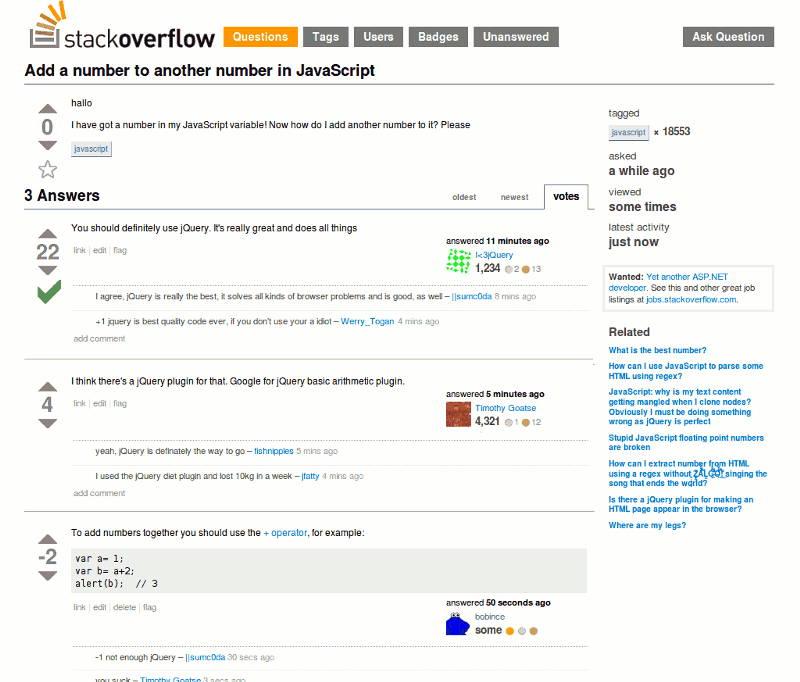

Há uns dias atrás, no [primeiro hangout](https://www.youtube.com/watch?v=2kJ-Ka-FzRk) do [React Cast](https://www.youtube.com/channel/UC4wkWQBqfo6zdJRt0IncFjw), apareceu o assunto sobre como [_React_](https://facebook.github.io/react/) e [_Redux_](http://redux.js.org/docs/introduction/) nos faziam ser programadores melhores. Nesse post vou esclarecer os pontos que me levam a acreditar nisso.


Quando começamos a trabalhar como programadores, é muito comum aprendermos a trabalhar com abstrações que facilitam nosso caminho e nossa curva de aprendizado. Um grande exemplo disso é o [_jQuery_](https://jquery.com/), que provavelmente é a primeira lib que os desenvolvedores Frontend tem contato.

Abstrações são ótimas, elas podem facilitar muito as nossas vidas e aumentar nossa produtividade. Porém, é muito comum programadores ficarem presos às abstrações e esquecerem de aprender os fundamentos básicos referentes a tecnologia abstraída. Os programadores se prendem aos vícios das abstrações e ficam completamente dependente delas.

Existe esse meme clássico que exemplifica claramente isso:



É importante você saber pensar por fora das abstrações, para saber quando ou não utilizá-las.

> Se a única ferramenta que você tem é um martelo, para você tudo começa a se parecer com um prego.

Como é o caso de inúmeras animações ainda feitas em _jQuery_, mas que facilmente poderiam ser substituídas por CSS.


> **Disclaimer**: Antes de continuar este artigo, deixo claro que eu trabalhei mais de um ano com Angular, em grandes aplicações, antes de começar a trabalhar com React, e ainda trabalho com o mesmo em aplicações já em produção. Falo aqui como alguém que antes defendia muito o Framework e adorava trabalhar com ele.

Trabalhando com [_Angular_](https://angularjs.org/) e outros Frameworks, nós acabamos seguido p0r esse mesmo caminho, de pensar como resolver problema **X** com o framework, antes mesmo de pensar como poderíamos resolver sem ele.

Um claro exemplo que eu poderia dar, seria o _angular_**.**[**forEach**](https://docs.angularjs.org/api/ng/function/angular.forEach)**.** Nós poderíamos simplesmente utilizar _Array_.[**forEach**](https://developer.mozilla.org/pt-br/docs/Web/JavaScript/Reference/Global_Objects/Array/forEach)**,** nativo do Javascript.

Eu sei que há casos em que você precisa iterar sobre um objeto e não um _array_, para isso, bastaria utilizar [**Object.keys**](https://developer.mozilla.org/pt-br/docs/Web/JavaScript/Reference/Global_Objects/Object/keys)(_Array_).**forEach**, também nativo.  Mas com o Angular é mais cómodo, não é?

Nós não paramos por aí, utilizamos _factory, service, session, value, constant, dependency Injection,_ tudo isso específico do angular. Quando precisamos fazer uma integração específica, como integrar a aplicação com um serviço de [_websocket_](https://developer.mozilla.org/pt-br/docs/WebSockets), utilizamos módulos como [_Angular Socket IO_](https://github.com/btford/angular-socket-io), ao invés de utilizar diretamente o [_socket.io-client_](https://github.com/socketio/socket.io-client). Aos poucos você olha para a sua aplicação e percebe que ela está totalmente acoplada e dependente do framework.

Você pode vir com o argumento que é possível deixar a aplicação menos acoplada e que esses módulos na maioria das vezes só lidam com a natureza assíncrona do _Angular_. Mas tentar deixar o _Angular_ menos acoplado, utilizando funções construtoras ao invés de factories e ai por diante, implica em ainda ter que implementar inúmeros workarounds ao longo do código, como por exemplo: [_$scope.$apply_](https://docs.angularjs.org/api/ng/type/$rootScope.Scope#$apply) _para_ sincronizar o [_digest cycle_](https://docs.angularjs.org/guide/scope)_._ Sem contar que esse não é o _Angular_ way de trabalhar e seria considerado uma má prática.

E mesmo contornando essas dependências de inúmeras formas, no final do dia você ainda não conseguiria rodar nenhum teste unitário sem ter o _Angular_ como dependência, pelo menos, não de uma forma viável.

Eu sei, peguei bastante no pé do _Angular_, mas justamente por ele ser um dos frameworks mais populares, por eu ter mais experiência com o mesmo, e porque utilizando-o como exemplo, é fácil expor os problemas que é se amarrar a um framework.

Ter um framework que cobre de ponta a ponta da sua aplicação é ruim, porque toda a aplicação tende a ser desenvolvida da maneira dele. Se amanhã surge uma lib que resolve uma parte do problema de uma maneira melhor que o seu framework, dificilmente você vai conseguir migrar somente uma responsabilidade para a lib, pelo menos, não de forma fluída.

Vemos esse mesmo tipo de opinião também no Backend. No post [_O fim da era dos frameworks full stack_](http://eltonminetto.net/2016/03/15/o-fim-da-era-dos-frameworks-full-stack/) o [Elton Minetto](https://medium.com/u/4485cf75ad68) fala sobre o assunto.

O problema em si não é o _Angular_, mas todo framework que te força a trabalhar da maneira dele e que você precisa “comprar o pacote completo” para se beneficiar apenas de uma feature ou outra.

### Arquitetura desacoplada

Agora que conseguimos entender o que é um cenário totalmente acoplado, fica mais fácil compreender as vantagens de uma arquitetura desacoplada.

#### Separation of concerns(SoC)


Brinquedo de Lego

[_Separation of Concerns_](https://en.wikipedia.org/wiki/Separation_of_concerns), ou _Separação de conceitos_, termo cunhado por [Edsger W. Dijkstra](https://en.wikipedia.org/wiki/Edsger_W._Dijkstra), em 1974.

No básico, se refere a identificar as responsabilidades que existem dentro de uma aplicação, isolá-las e delegá-las, de uma forma que fique claro o que cada parte do seu software faz e que fique claro onde deve ser feito cada coisa.

A adoção desse princípio traz inúmeras vantagens como: Facilidade na manutenção, facilidade para encontrar e resolver bugs e facilidade para compreender o software como um todo.

Utilizando corretamente esse conceito, fica fácil substituir determinada parte do seu software quando necessário.

> Seu software deve parecer com um brinquedo de lego, onde você pode tirar uma peça amarela, colocar uma azul e ele continua funcionando, se limitando apenas a possuir as mesmas entradas e saídas.

### Single Page Applications

Vamos tentar distinguir os aspectos e as responsabilidades dentro de uma [_SPA_](https://en.wikipedia.org/wiki/Single-page_application).

Nós podemos separar um SPA em três partes: **State**, **View** e **Actions.**

#### State

Todos os dados que existem dentro da nossa aplicação, desde os dados buscados por requests, até os dados definidos estaticamente no código.

#### View

_B_asicamente, é nosso HTML e CSS, que são renderizados de acordo com os dados que existem dentro da nossa aplicação.

#### Actions

São os eventos que ocorrem dentro da nossa aplicação, que poderão ou não alterar o _State_.

Podemos dividir esses eventos em duas categorias:

**— Interação do usuário:** Click em botão, entrada de dados em um formulário, etc…

**— IO**: Eventos de rede, como início e fim de um request.

A forma como cada uma dessas partes se integram é bem simples. O _State_ fica responsável por armazenar os dados e entregá-los para a _View._ A _View_ por sua vez, irá se renderizar de acordo com os dados que recebe do _State_. As _Actions_,  ao ocorrerem,  poderão causar uma alteração no _State_, que entrega os novos dados para _View_ e assim segue esse ciclo.

Essas características podem ser vistas em qualquer _SPA_, independente da tecnologia em que seja desenvolvida. O problema é que muitos frameworks deixam essas três características totalmente acopladas, não sendo possível substituir o “responsável” por cada uma.

### React

Entre as três características que vimos, o React se propõe a ser o responsável por apenas uma, a _View._ O React não se importa em como você controla seu _State_ ou suas _Actions_, ele só recebe os dados através de suas props e interage com o [_DOM_](https://pt.wikipedia.org/wiki/Modelo_de_Objeto_de_Documentos) para renderizar a _View._

### Redux

Ao contrário do _React_, o _Redux_ é alheio a sua camada de _View_, ele fica responsável apenas pelo _State_ e pelas _Actions_ da sua aplicação, dando a você total poder de escolha em relação a _View_.


A [_Store_](http://redux.js.org/docs/api/Store.html) do _Redux_ disponibiliza três métodos para interação com o _State_ através de sua [API pública](http://redux.js.org/docs/api/Store.html#store-methods):

#### [_subscribe_](http://redux.js.org/docs/api/Store.html#subscribe)

Esse método permite que você adicione um listener à _Store_, que será chamado, toda vez que houver uma alteração no _State._

#### [_dispatch_](http://redux.js.org/docs/api/Store.html#dispatch)

Através desse método, você dispara as _Actions_.

#### [_getState_](http://redux.js.org/docs/api/Store.html#getState)

Executando esse método, você receberá o _State_ atual. Esse método é normalmente utilizado dentro dos listeners, para capturar o _State_ após uma alteração ter ocorrido.

Com esses três métodos, é possível integrar o _Redux_ com qualquer lib de renderização da _View_.

Analisando essas duas libs, nós conseguimos enxergar a forma como as suas se complementam e se integram uma com a outra e também conseguimos ver que mesmo se complementando, elas conseguem trabalhar de forma independente, deixando a aplicação muito menos acoplada.

#### Programação funcional

O _Redux_ é baseado em conceitos de programação funcional, como imutabilidade e funções puras. É através dessas funções que nós manipulamos o _State. As funções em questão são os R_[_educers_](http://redux.js.org/docs/basics/Reducers.html)_, que possuem a seguinte assinatura:_

```js
(currentState, action) => newState
```

Observando a estrutura acima, percebemos que não precisamos depender do _Redux_ para escrever nossos testes unitários, uma vez que você só precisaremos chamar um _Reducer_, passando um objeto para simular o _State_ atual e um outro objeto que será a _Action_, e fazer uma asserção com o valor de retorno.

O mesmo vale para o teste de [_Action Creators_](http://redux.js.org/docs/basics/Actions.html#action-creators), que também devem ser funções puras.

Na documentação do _Redux_, há uma [sessão dedicada a escrita de testes](http://redux.js.org/docs/recipes/WritingTests.html), vale a pena conferir.

Os conceitos de programação funcional que o _Redux_ traz, ajuda muito a expandir nosso conhecimento e nossa forma de pensar como escrevemos nossa lógica, além de ser porta de entrada para muita gente nesse novo paradigma.

O Redux e o React se baseiam numa arquitetura de fluxo dados uni-direcional, o que nos dá um controle bem maior, e não cria dificuldades na hora de integrarmos uma nova lib ao projeto.

### Ainda sobre React

O _React_ nos induz a desenvolver nossa aplicação orientada a componentes, fazendo com que o reaproveitamento de código seja bem efetivo e tornando nossa aplicação muito mais modular.

Além disso, podemos contar com inúmeras ferramentas que melhoram nosso workflow, como o [_React Hot Loader_](https://github.com/gaearon/react-hot-loader)_,_ que nos concede uma experiência de desenvolvimento muito rica, e o  [_React Storybook_](https://github.com/kadirahq/react-storybook), que nos permite desenvolver nossos componentes de forma isolada, nos dando um controle que até então não tínhamos no Frontend.

### Por que React e Redux nos fazem ser programadores melhores?

Em um resumo geral, _React_ e o _Redux_ nos ensinam a pensar em nossas aplicações de forma modular nos induzindo a identificar e separar as responsabilidades de uma forma bem intuitiva. A facilidade que o _React_ traz para trabalharmos com componentes, nos conduz a os separá-los de uma forma melhor, o que por si só já resulta em um reaproveitamento maior do código. A forma como cada lib se contém a sua responsabilidade, nos permite aprender a desenvolver aplicações de uma forma desacoplada. Os conceitos que o _React_ e o _Redux_ introduzem, traz um ganho sem tamanho para nós desenvolvedores.

Gostou do post e achou útil? Dê um **like** ❤️ abaixo para ajudar na divulgação e para que mais pessoas tenham acesso :)
