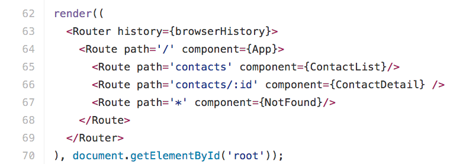
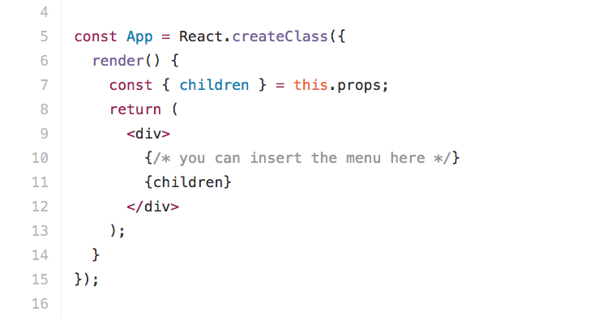
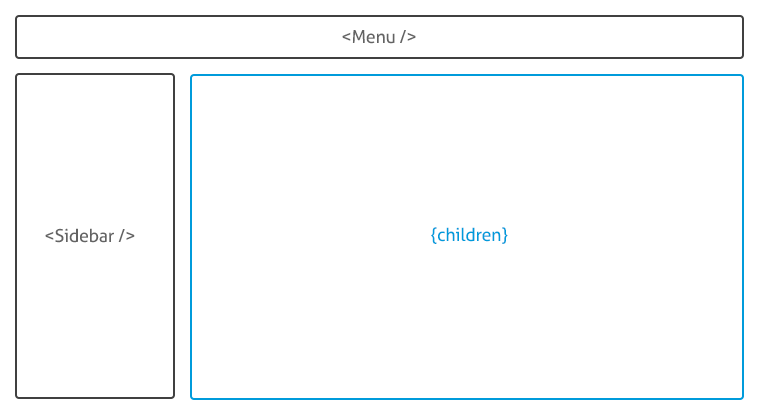

Quando começamos a desenvolver um [SPA](https://en.wikipedia.org/wiki/Single-page_application), uma das primeiras coisas que precisamos definir é a forma como controlamos as rotas da aplicação. Em React isso não é diferente.

[React Router](https://github.com/reactjs/react-router) é uma lib completa para controle de rotas. Ela permite que você consiga configurar rotas utilizando o formato [JSX](https://facebook.github.io/react/docs/jsx-in-depth.html) e também disponibiliza uma API para você configurar diretamente via Javascript.

A lib trabalha com [**History API**](https://developer.mozilla.org/pt-BR/docs/Web/API/History), mas também deixa a possibilidade de você trabalhar com **Hash**(#) se for necessário.

Ela possui features como: Rotas aninhadas, lazy loading de componentes, matching para rotas dinâmicas e controle de transição de rotas, além de possuir suporte a [**server-rendering**](https://facebook.github.io/react/docs/environments.html).

Para utilizá-la, basta instalar utilizando o npm:

npm install react-router --save

Em nosso exemplo abaixo, podemos ver como ficaria a estrutura básica para uma aplicação de agenda de contatos. Essa aplicação possuirá duas telas: uma tela para a listagem dos contatos e outra tela para a visualização detalhada do contato.

Teremos quatro componentes:

*   **App** — O componente container da nossa aplicação.
*   **ContactList** — Nossa lista de contatos.
*   **ContactDetail** — Nosso componente de visualização de detalhes do contato.
*   **NotFound** — Nossa página 404.

> No exemplo acima, os componentes estão no mesmo arquivo apenas para fins didáticos. É uma boa prática manter apenas uma definição de componente por arquivo.

No bloco abaixo, temos a definição de todas as nossas rotas. Os componentes que utilizamos para essa definição são o **Router** e o **Route.**

**Router**

Componente raiz da aplicação. Todas as rotas devem ser definidas dentro dele e deve existir somente um **Router** por aplicação.

O router espera receber o parâmetro **history**, que é o objeto que ele utilizará para o controle da transição das páginas. Esse objeto é diretamente importado do react-router, podendo ser o [**browserHistory**](https://github.com/reactjs/react-router/blob/master/docs/API.md#browserhistory)  ou o [**hashHistory**](https://github.com/reactjs/react-router/blob/master/docs/API.md#hashhistory)**.**

#### **Route**

É cada rota da nossa aplicação. Espera como parâmetros as props:

*   **path **— utiliza para fazer matching com a url.
*   **component **— componente que será renderizado caso a url dê matching com o **path.**

O path aceita alguns formatos para definição da rota:

// Rota estática, ou fixa:
path='contacts'

// Rota com parâmetros:
path='contacts/:id'

// Rota com parâmetros opcionais:
path='contacts(/:id)'

Os parâmetro passados pelas rotas chegam no componente através da propriedade **params**. No exemplo acima, poderíamos acessar o parâmetro **id** de dentro do componente respectivo à rota da seguinte forma:

componentDidMount() {
  const id = this.props.params.id;
  ...
}

Outro formato aceito é utilizando o **\*,** que funciona como um coringa:

**path=’\*’**
fará matching com todas as rotas

**path='contacts/\*'**
fará matching com todas as rotas a partir de contacts.
ex:
 contacts/
 contacts/example
 contacts/123

> Mais detalhes sobre os formatos suportados podem ser encontrados [nesse link da docs](https://github.com/reactjs/react-router/blob/master/docs/guides/RouteMatching.md).

Um ponto importante a ressaltar é que somente uma rota fará matching por vez, e a prioridade delas vem de cima para baixo. Por esse motivo, conseguimos fazer nossa página 404 apenas utilizando o **path=’\*’** e colocando ele abaixo de todas as rotas. Caso não for feito matching com nenhuma rota anterior, ele chega nessa rota e renderiza o component **NotFound.**

#### **Rotas aninhadas**

É comum em nossas aplicações utilizarmos rotas aninhadas. No nosso exemplo acima já estamos utilizando, mas talvez não tenha ficado evidente:

<Route path='**/**' component={App}>
  <Route path='**contacts**' component={ContactList} />
  ...
</Route>

Nesse trecho, podemos observar que a rota **contacts** está aninhada a rota **/** que é nossa rota raiz.

Nossa rota raiz renderiza o componente **App**, que atualmente funciona apenas como um layout base da nossa aplicação.

Nele poderíamos colocar o rodapé, o menu e componentes que sempre estarão na tela, independentemente da rota em que estivermos.

Na imagem acima, na linha 7, acessamos a propriedade **children** que é inserida pelo **react router** no nosso componente. Nesse caso, **children** seria o componente respectivo a uma rota aninhada. Por exemplo:

// URL atual: 'http://app.myapp.com/**contacts**'

<Route path='**/**' component={App}>
  <Route path='**contacts**' component={**ContactList**} />
  <Route path='contacts/:id' component={ContactDetail} />
</Route>

Dada a url atual e a nossa configuração de rotas, o **children** do nosso componente **App** seria o componente **ContactList.**

Abaixo segue um layout que com frequência vemos em aplicações:

No layout acima, temos o menu superior e a sidebar que estarão em todas as telas e temos o conteúdo central, que mudará de uma rota para outra.

Nesse caso, poderíamos manter o **Menu** e a **Sidebar** no nosso componente **App**, renderizando o children ao centro.

render () {
  return (
    

      <Menu />
      <Sidebar />
      <section className='content-wrapper'>
        {children}
      </section>
    

  );
}

Em nosso exemplo da agenda, só utilizamos um nível de aninhamento de rota, mas é possível utilizar quantos forem necessários:

<Route path='/' component={App}>
  <Route path='contacts' component={ContactList} />
  <Route path='contacts:id' component={**ContactDetail**}>
    <Route path='**calls**' component={**ContactCalls**} />
  </Route>
</Route>

Nesse exemplo acima, temos uma rota aninhada dentro da visualização do contato. Nessa rota iríamos mostrar, abaixo das informações do contato, uma lista de ligações feitas para o mesmo.

Quando a rota **calls** fizer matching, o componente **ContactCalls** estará disponível através da propriedade **children** do componente **ContactDetail.**

**ContactCall** fica como o children de **ContactDetail** que por sua vez é children de **App.**

Cat inception

#### Link

O componente Link é utilizado para fazer a navegação das páginas. esse componente aceita os seguintes parâmetros:

#### **to**

O destino para o link, que pode ser passado em dois formatos, string ou objeto.

Em caso de string, deve ser o caminho absoluto para a página, ex:

<Link to='**/contacts/123**'>Contato 123</Link>

Em caso de objeto, pode conter os seguintes parâmetros:

{
  **pathname**: 'String representando o caminho para o link',
  **query**: 'Um objeto com chave valor dos parâmetros da url',
  **hash**: 'Uma hash para colocar na URL, ex: #uma-hash.',
  **state**: 'state a ser persistido para o location'
}

#### **activeClassName**

className a ser inserido no link quando a url do link em questão estiver ativa. É uma forma fácil de estilizar seu link ativo no menu de navegação.

#### activeStyle

Bem parecido com o activeClassName, mas ao invés do className, aceita um objeto de estilos CSS.

Os demais atributos podem ser encontrado nesse [link da docs](https://github.com/reactjs/react-router/blob/master/docs/API.md#link).

Com esses componentes, já é possível construir uma aplicação baseada em rotas. Mas o controle de rotas não para apenas por aqui, há outras questões como rotas dinâmicas e controle de autenticação de usuário que eu pretendo abordar em posts futuros.

Para se aprofundar no tema, aconselho começar pela [documentação](https://github.com/reactjs/react-router) que hoje se encontra no Github.

Gostou do post e achou útil? Dê um **like** ❤️ abaixo para ajudar na divulgação e para que mais pessoas tenham acesso :)
