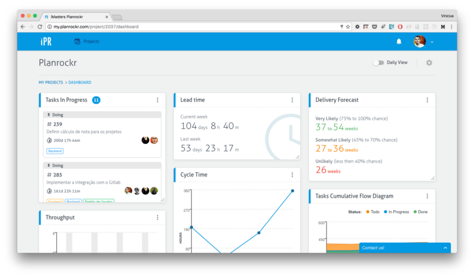

Há uns dias atrás, foi feita uma pergunta para a equipe do [Planrockr](http://planrockr.com/pt-br/) no twitter:

Esse é um assunto interessante a ser abordado: Quando uma aplicação deve ou não ser uma _SPA_? Nesse artigo não pretendo fazer menção a nenhum framework em específico, mas nos manter focados nas vantagens e desvantagens deste tipo de arquitetura.

### Server Generated Pages

Antes de avançarmos para o _SPA_, é necessário entendermos o modelo convencional de como os navegadores interagem com as páginas web. No modelo que aqui chamaremos de _SGP_ (Server Generated Pages), exemplificado por um blog, ao acessar sua página principal, o servidor web entrega como resposta um documento _HTML_ contendo todo o código da página em específico. Ao navegarmos pelos links, o navegador faz novas requisições ao servidor que responde com o código das outras páginas.

As vantagens dessa arquitetura são:

*   Controle de rotas e estados gerenciados nativamente pelo browser.
*   Conteúdo estático gerado pelo Backend, o que permite que seu site seja totalmente acessível às [Search Engines](https://en.wikipedia.org/wiki/Search_engine_%28computing%29) e seus scripts e estilos sejam menores.

Porém, esse tipo de arquitetura possui algumas desvantagens. A cada troca de página, o navegador fará requisições em busca do novo documento _HTML_, estilos e scripts. Nesse intervalo, não é possível nem mesmo mostrar um _loading indicator,_ o que  deixa a navegação menos fluída e afeta a experiência do usuário.

Com a evolução da web, surgiu a necessidade de construirmos aplicações com uma experiência mais próxima das aplicações _desktop,_ o  que  fez com que um outro tipo de arquitetura tomasse espaço, que hoje é conhecida por _Single Page Application._

### Single Page Application

Esse tipo de arquitetura segue um fluxo um pouco diferente, vamos tomar o [Planrockr](http://my.planrockr.com/login) como exemplo:

Ao acessarmos uma página, é feito uma requisição ao servidor em busca de um documento _HTML_, que nesse caso, é sempre o _index_. Se inspecionarmos o [código fonte desse _index_](http://view-source:http://my.planrockr.com/#/login), dentro do body, a única marcação que encontramos é a tag:

A _tag_ acima é necessária para que nossa aplicação seja inicializada. Além de conter essa _tag_, o _index_ linka os arquivos _vendor.js_, _app.css_, _app.js_, que são os scripts e estilos necessários para a nossa aplicação funcionar.

Conforme navegamos entre as páginas, o Javascript gera o conteúdo de forma dinâmica, não sendo feita nenhuma requisição ao Backend para a busca de um novo documento _HTML_. Essa abordagem possibilita uma navegação mais fluída e facilita o desenvolvimento de interfaces mais ricas e interativas. Além dessas vantagens, toda a comunicação com o Backend é feita via _API_, o que endossa o conceito de _API First_ e deixa o Backend totalmente desacoplado do Frontend_._ Seguindo esses conceitos_,_ fica muito fácil integrar uma aplicação mobile ou até mesmo uma aplicação de terceiro futuramente.

Porém, essa abordagem possui alguns pontos negativos:

*   O conteúdo é gerado pelo Javascript, o que não permite que sua aplicação seja acessível às [_Search Engines_](https://en.wikipedia.org/wiki/Search_engine_%28computing%29). Se isso é um problema ou não, dependerá da sua aplicação. Para descobrir, faça a seguinte pergunta: Eu preciso que a minha aplicação seja encontrada pelos mecanismos de busca? Se a resposta for SIM, prefira ir pela abordagem da _SGP_ ou então pesquise por  Aplicações Isomórficas.
*   O fato de carregarmos todos os scripts e estilos necessários à nossa aplicação antes da inicialização, torna o tempo do primeiro carregamento um pouco maior. Já existem maneiras para melhorar essa questão, como separar alguns scripts para serem carregados conforme as rotas que você acessa, não carregando todos de uma só vez.

### Por que optamos construir o Planrockr como uma SPA?

Construimos o Planrockr como uma _SPA_ para proporcionar ao usuário uma experiência mais próxima de uma aplicação _desktop_.

Dashboard de Projeto do Planrockr.

A imagem acima apresenta o Dashboard de Projetos. Essa tela, é uma das principais do Planrockr e possui inúmeros _widgets_ com dados carregados independentemente. Conforme esses dados são carregados, os _widgets_ se tornam acessíveis ao usuário instantaneamente, o que possibilita uma melhor experiência. Além disso, os dados dos _widgets_ são recarregados de tempos em tempos e o controle desse fluxo se faz muito mais fácil em um _SPA_.

Quanto ao [_SEO_](https://pt.wikipedia.org/wiki/Otimiza%C3%A7%C3%A3o_para_motores_de_busca), o Planrockr é uma aplicação que tem seu conteúdo dependente da sessão d0 usuário, o que elimina a necessidade de ser acessível às _Search Engines_.

A possibilidade de termos um Backend totalmente independente do Frontend também pesou na hora de decidirmos. Como temos profissionais das duas especialidades, podemos implementar a _API_ e a Interface em paralelo, proporcionando muito mais velocidade ao desenvolvimento. Separando os lados da aplicação, fica muito mais fácil implementar soluções e resolver problemas de forma isolada, deixando as preocupações de cada parte para seus respectivos especialistas. Essa abordagem permite que os profissionais tenham mais foco, tanto na hora de aprender quanto na hora de implementar.

### Conclusão

As duas abordagens são bem válidas, é preciso parar e analisar as vantagens e desvantagens de cada uma para se tomar uma decisão acertiva. Busque sempre encontrar soluções simples. Não adianta utilizar React ou Angular em um hotsite só porque são as _libs_ da vez. Pense primeiro no problema que você está propondo-se a resolver e utilize a melhor ferramenta para o trabalho.

É possível pregar até utilizando um alicate, mas seria muito mais eficiente utilizar um martelo, não acha?

Gostou do post e achou útil? Dê um **like** ❤️ abaixo para ajudar na divulgação e para que mais pessoas tenham acesso :)

A thanks to [Raony](https://medium.com/u/12176e88f212) and [Camila](https://medium.com/u/2b001f1436f6) for reviewing this post.
