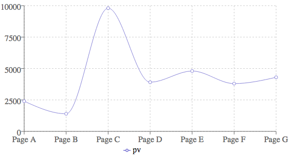
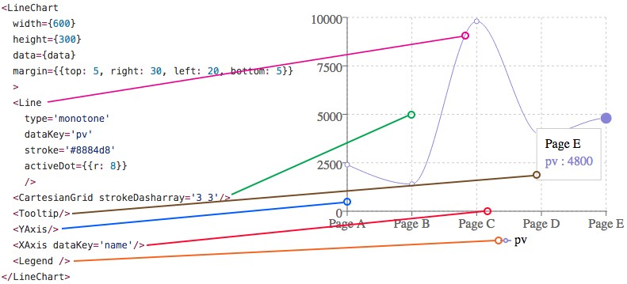
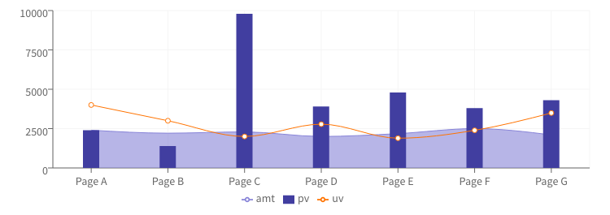
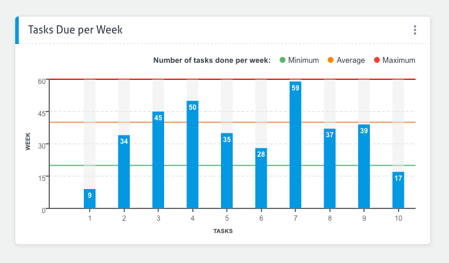
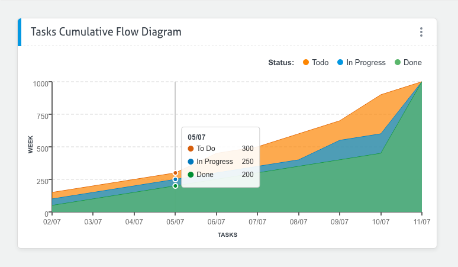

Recentemente iniciamos o desenvolvimento de [mais cinco widgets](https://blog.planrockr.com/novo-plano-novos-conte%C3%BAdos-e-gr%C3%A1ficos-no-planrockr-f2b4ab0c9d18#.vudj5kkkc) no [iMasters Planrockr](http://planrockr.com), todos de gráficos. Para a renderização dos mesmos, optamos por usar o [**D3JS**](https://d3js.org/), que é uma das libs mais robustas para a implementação de gráficos atualmente.

Seria possível implementá-los utilizando somente **D3** e foi dessa forma que começamos a implementar o primeiro gráfico. No entanto, aprender a lib do zero pode exigir um tempo e esforço considerável, não sendo nada produtivo no estado inicial. No meio do caminho, acabamos conhecendo uma outra lib para React que abstrai o **D3JS**, a [**Recharts**](http://recharts.org/).

Essa lib possui uma excelente documentação e conta com vários exemplos. Os gráficos são altamente customizáveis, tanto pelos próprios parâmetros dos components quanto pelo CSS.

Para instalar ela em seu projeto é bem simples.

Utilizando o npm:

npm install recharts --save

No nosso componente, importamos os componentes do **Recharts** que iremos utilizar para montar o gráfico. Abaixo segue o exemplo de como ficaria o código para um gráfico de linhas:

Com o código acima, obtemos o seguinte resultado:

Gráfico de linha renderizado pelo Recharts.

Na imagem abaixo conseguimos observar quais são os elementos que compõem o gráfico:

Cada tipo de gráfico possui seu respectivo componente raiz, que no caso do gráfico acima, é o **LineChart.**

Cada tag interna ao **LineChart** representa um componente do gráfico, que normalmente são mais genéricos e são utilizados por mais de um tipo de gráfico. Cada um desses componentes possui seus respectivos parâmetros de configuração, fazendo com que o gráfico fique fácil de ser customizado. Os mesmos podem ser consultados na sessão [API](http://recharts.org/api) da documentação.

Além do [LineChart](http://recharts.org/api#LineChart), a lib possui outros tipos de gráficos, como:

*   [AreaChart](http://recharts.org/api#AreaChart)
*   [BarChart](http://recharts.org/api#BarChart)
*   [PieChart](http://recharts.org/api#PieChart)
*   [RadarChart](http://recharts.org/api#RadarChart)
*   [RadialBarChart](http://recharts.org/api#RadialBarChart)
*   [ScatterChart](http://recharts.org/api#ScatterChart)
*   [Treemap](http://recharts.org/api#Treemap)

Ainda é possível mesclar alguns desses gráficos entre si, utilizando o [ComposedChart](http://recharts.org/api#ComposedChart), que permite mesclar um gráfico de linhas, com um de área e com um de barra por exemplo, como podemos ver na imagem abaixo:

### Customização por CSS

Cada um dos componentes do gráfico possui suas classes, o que permite que você os customize através de css, sobrescrevendo os estilos globais. Alguns deles permitem que você forneça um **className**, tornando o trabalho ainda mais fácil.

Abaixo segue o exemplo de dois gráficos customizados, que foram implementados utilizando a lib:

### Responsividade

Ainda é possível construir gráficos responsivos utilizando o componente [**ResponsiveContainer**](http://recharts.org/api#ResponsiveContainer), que ainda aceita os parametros **width** e **height** em percentagem ou em pixel. Para utilizá-lo, basta colocá-lo como wrapper do componente pai do gráfico, conforme abaixo:

<ResponsiveContainer>
  <LineChart>
   ...
  </LineChart>
</ResponsiveContainer>

Clique [aqui](http://recharts.org/examples#AreaResponsiveContainer) para ver alguns exemplos.

Gostaria de finalizar o post deixando os parabéns para [essa equipe](https://github.com/recharts/recharts/graphs/contributors) que criou e que mantém a lib. Nunca foi tão fácil construir gráficos!

Gostou do post e achou útil? Dê um **like** ❤️ abaixo para ajudar na divulgação e para que mais pessoas tenham acesso :)
