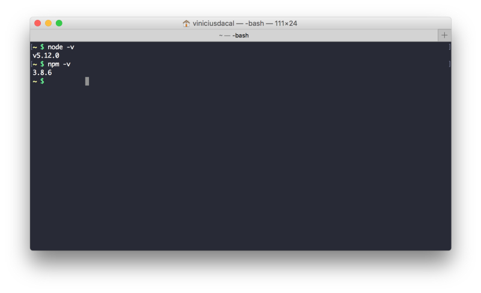
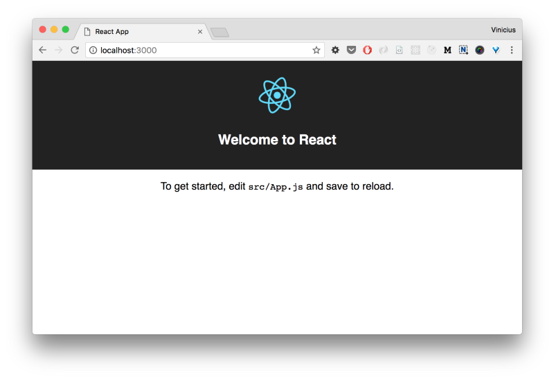
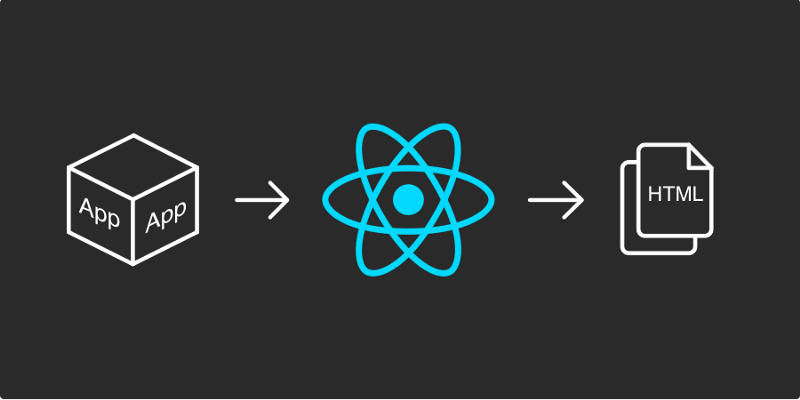

Montar a estrutura de um projeto React e configurar o build manualmente, pode ser um pouco confuso de início. Por esse motivo, iremos utilizar o comando [_create-react-app_](https://github.com/facebookincubator/create-react-app), que gera por padrão uma estrutura básica, pronta para começarmos a desenvolver nossa aplicação. Dessa forma, você não precisa entender todo o processo do build antes mesmo de criar o seu primeiro componente.

Posteriormente, veremos cada parte do build para entender melhor com o que estamos lidando.

> Nota: Este post faz parte da serie “Iniciando com React”.
> [< Anterior](https://medium.com/@viniciusdacal/iniciando-com-react-parte-1-a79d74fe8f8c) | [Próximo >](https://medium.com/@viniciusdacal/iniciando-com-react-3-criando-componentes-97f7023ca5ab)

### Instalando Create React

> Para a instalação do CLI é necessário que você já tenha o Node e o NPM instalados na sua máquina. Para verificar se eles estão instalados, execute os seguintes comandos no terminal:

> $ node -v
> $ npm -v

> É aconselhável que a versão do Node seja igual ou superior à 5.10.0 e do NPM seja igual ou superior à 3.0.0.

> Caso você ainda não tenha o Node e o NPM instalados, faça [download](https://nodejs.org/en/) pelo site e siga os passos do instalador: [https://nodejs.org/en/](https://nodejs.org/en/)


output dos comandos node -v e npm -v

Com o **node** e o **npm** instalados, execute o seguinte comando:

**$** npm install -g create-react-app

O comando acima instala globalmente o módulo _create-react-app_, para que o mesmo fique acessível pelo terminal. O Processo de instalação deve finalizar em alguns minutos.

### Criando o primeiro projeto

Com o comando abaixo, iremos criar um projeto chamado **my-app**:

**$** create-react-app my-app

O comando acima gera a estrutura do nosso projeto e a coloca em uma nova pasta com o mesmo nome, **my-app**.

Vamos entrar no diretório do projeto utilizando o comando:

**$** cd my-app

E por fim, iniciaremos o build da aplicação.

**$** npm start

Além de iniciar o build da aplicação, o comando acima levanta um servidor e fica escutando por alterações nos arquivos.

Já é possível acessar a url [**http://localhost:3000**](http://localhost:3000/)**/** no navegador e ver uma tela de boas vindas:



### Explorando a estrutura do projeto

Há inúmeras maneiras de organizar um projeto React, mas esse não é o foco desse post. Aqui, iremos explorar a estrutura default para entendermos como as partes se conectam, e o que realmente é necessário para o bootstrap do React.

O _create-react-app_ cria a seguinte estrutura inicial:

```
my-app/  README.md  node_modules/  package.json  .gitignore  public/    favicon.ico    index.html  src/    App.css    App.js    App.test.js    index.css    index.js    logo.svg
```

Vamos manter nosso foco nos arquivos **package.json**, **public/index.html** e nos arquivos da pasta **src**.

#### Scripts e dependências

Observe abaixo o conteúdo do **package.json** que lista as dependências do projeto e possui alguns _aliases_ para os scripts envolvidos no build:

arquivo package.json gerado pelo create-react-app

Como podemos ver no arquivo acima, temos os módulos react e react-dom declarados como dependência, e o react-scripts declarado como uma dependência de desenvolvimento. O react-scripts é o módulo que encapsula todos os scripts e configs do build.

Também podemos observar que estão sendo declarados alguns scripts, que possuem funcionalidades conforme listadas abaixo:

*   **start:** Inicia o build no modo de desenvolvimento.
*   **build**: Executa o build do projeto otimizado para produção.
*   **test**: Executa os testes do projeto.
*   **eject**: Traz para dentro do nosso projeto, toda a configuração que o react-scripts abstrai. **Não use este comando por enquanto!** Utilizaremos mais a frente para estudar o processo do build.

#### Index

Observe abaixo o código do arquivo **public/index.html**:

arquivo public/index.html gerado pelo create-react-app

O arquivo **index.html** vem com a marcação mínima necessária para iniciar nossa aplicação. Porém, é possível observar que não há tags de scripts ou estilos. Não se preocupe, as mesmas serão injetadas automaticamente no build.

Por ora a única coisa importante a observar é a tag div com o id **root** na linha #10, é ela que o _React_ irá utilizar para renderizar nossa aplicação.

#### Componente raiz

Vamos explorar o conteúdo da pasta **src**. Observe abaixo o arquivo **App.js**, que contém o componente raiz da aplicação:

arquivo src/App.js gerado pelo create-react-app

O componente acima é definido com a _class_ e extende a classe _Component do React. E_xistem duas formas de definir componentes, através de _functions_ ou através de _class_. Em um [futuro post](https://blog.coderockr.com/iniciando-com-react-3-criando-componentes-97f7023ca5ab) veremos as diferenças entre uma e outra.

Um componente deve sempre implementar um método **_render_**, que retorna um **_JSX_** do que deve ser mostrado na tela, ou **null** quando não deve mostrar nada.

#### JSX

O que parece ser um HTML dentro do método **render**, é na verdade [JSX](https://facebook.github.io/react/docs/introducing-jsx.html), um [_sintatic sugar_](https://pt.wikipedia.org/wiki/A%C3%A7%C3%BAcar_sint%C3%A1tico) para a API do React. As principais diferenças no dia-a-dia entre HTML e JSX são:

*   O **class** do html passa a se chamar **className**, porque o termo _class_ é uma palavra reservada no Javascript.
*   O **for** da tag _label passa a se chamar_ **htmlFor**, pelo mesmo motivo do _class_, de ser uma palavra reservada.
*   O conteúdo que estiver entre chaves `{}`, será interpretado como Javascript.
*   Todos os atributos são nomeados em [lower _camelcase_](https://pt.wikipedia.org/wiki/CamelCase)_._ Sendo assim, atributos como `onclick`, passam a se chamar `[onClick](https://facebook.github.io/react/docs/handling-events.html).` O mesmo vale para atributos que utilizam hífen `-`, `stroke-width` por exemplo, passa a se chamar `strokeWidth.`
*   Todo conteúdo do retorno de um render, deve estar dentro de um único wrapper, caso contrário o seguinte erro é apresentado: `Adjacent JSX elements must be wrapped in an enclosing tag while parsing file.`

É importante lembrar que o JSX é convertido em um código React, por esse motivo, devemos importar o módulo React em todo arquivo que utiliza a sintaxe.

> JSX já é utilizado por outras libs além do React e vem se tornando um padrão para definição de marcação de componentes.

> É possível seguir em frente com as informações apresentadas acima. Mas se você ficou instigado a saber mais sobre JSX, acesse: [facebook.github.io/react/docs/introducing-jsx.html](https://facebook.github.io/react/docs/introducing-jsx.html).

#### Importação de arquivos de estilos e imagens

Junto com a base do projeto, já vêm configurados os [_loaders_](https://webpack.github.io/docs/loaders.html) para os formatos **svg** e **css.** Quando importamos um arquivo **css**, o conteúdo do mesmo é injetado na nossa aplicação, permitindo assim que utilizemos os estilos e classes em nossos componentes.

Já o **svg** funciona de uma maneira um pouco diferente. Ao importarmos um **svg**, obteremos uma referência, um caminho para o arquivo, e poderemos utilizar essa referência em tags como `****` e `**<object>**`. A importação de outros arquivos de imagem como **jpg**, **png** e **gif** funcionam dessa mesma maneira, porém, nessa estrutura inicial apenas o **svg** é suportado.

#### Bootstrap da aplicação

Vamos observar abaixo o código do arquivo index.js, é nele que ocorre a inicialização da nossa aplicação:

arquivo src/index.js gerado pelo create-react-app

Na linha #2 do arquivo acima, estamos importando o **ReactDOM**, o módulo do React responsável pela manipulação do _DOM_.

Na linha #3, importamos nosso componente raiz, o **App.js** que acabamos de ver mais acima.

O _bootstrap_ do React se baseia em você dizer para ele, o que renderizar e onde injetar o que ele renderizou. Estamos fazendo isso na linha #6, através do método render do **ReactDOM**, que espera como primeiro parâmetro um componente, e como segundo parâmetro, um elemento do _DOM_ que será utilizado para injetar todo o HTML renderizado.


O React renderiza os componentes e gera um output HTML

No nosso caso, estamos passando o componente **App** para ser o raiz e o elemento que possui o id=”**root**”  para ser o que conterá toda a aplicação. Lembra da nossa tag no arquivo **public/index.html**? Ela mesmo!

> Não abordamos o conteúdo dos arquivos css e svg, pois os mesmos não possuem nenhuma particularidade quanto ao React. Também não abordamos a parte de testes, porque futuramente haverá um post específico sobre este tema. Mas nada impede que você os explore. Seja curioso!

### Conclusão

Aprendendo como criar a estrutura do projeto e a entendendo bem, torna os próximos passos muito mais fáceis. O **React** tem alguns princípios básicos, que bem aprendidos, permitem que construamos desde aplicações simples até as mais robustas.

No próximo post veremos como criar componentes e aprenderemos sobre o ciclo de vida de um componente React. **Siga-nos e não perca os próximos posts!**

Gostou do post e achou útil? Dê um **like** ❤️ abaixo para ajudar na divulgação e para que mais pessoas tenham acesso :)
