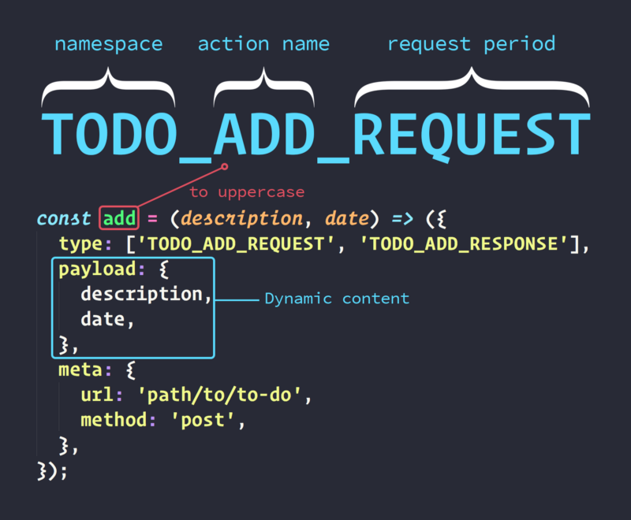
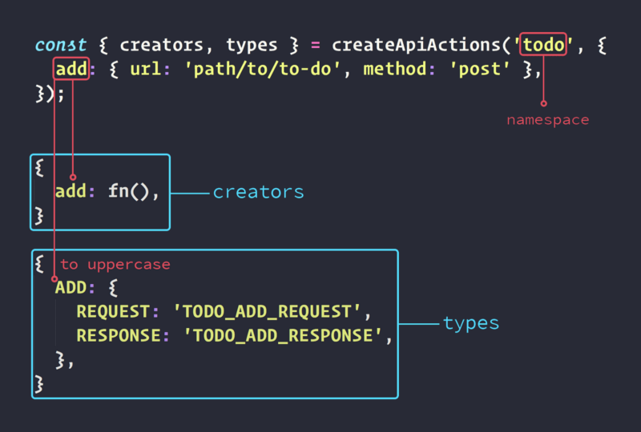
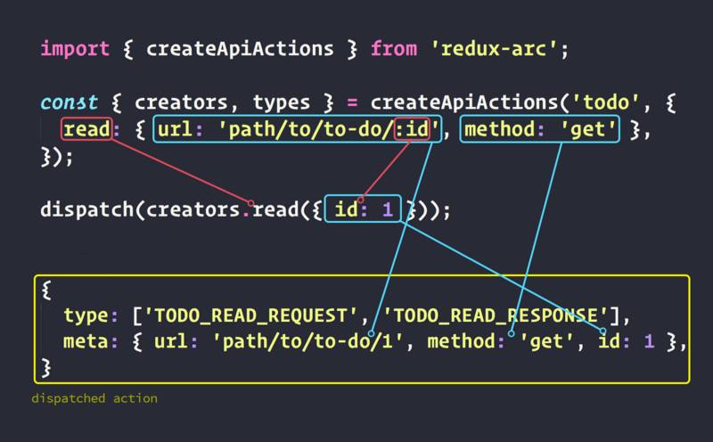
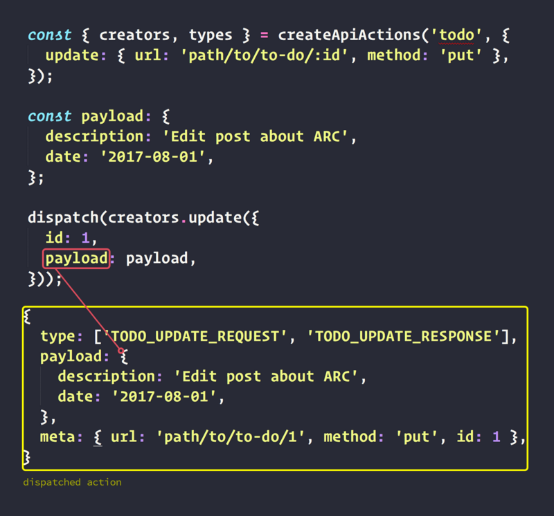

> **TL-DR:** This article’s goal is to explain in details how Arc works. If you are only looking for instructions on how to get started with Arc, you can go directly to the repository’s [README](https://github.com/viniciusdacal/redux-arc) or its [docs](http://redux-arc.org). However, it’s always good to know the tools you are working with.

A year ago, I wrote an article about how to handle async request in Redux apps. Since then, I passed through other projects and I end up using other technologies.

I have been working with redux apps for almost two years now, and I have tried different approaches to handle async requests. From the pain and frustrations I had on this process, an idea came up, to create a lib that abstracts the annoying parts. Something that cut off the code repetition, but at the same time were flexible and scalable, allowing the user to invest his time where it really matters. It that’s how [_Arc_](https://github.com/viniciusdacal/redux-arc) was born.

Arc is a 2kb lib, totally free of dependencies and 100% covered by tests.

We can split Arc in two independently parts:

*   **Types** and **creators** factory.
*   **AsyncMiddleware**.

### Core concepts

First of all, let explore the Arc’s core concepts, to understand better how it works and what it really does.

#### Action creator

An **action creator** is a function that is used to create **actions**. An **action creator** allows us to centralize the creation of a certain kind of **action**, what helps us to create a consistency in the application. You can see an **action creator** example bellow:

Accordingly to the above **action creator**, to get an **action** ADD\_TODO **,** we just need to execute the function **addTodo**, providing **description** and **date**, as the follow example:

#### Async Actions

An **async action**, is an **action** that describes a request. Bellow, you can see an example of an **async action** from _Arc_:

The first thing different we can notice is the **type**. The **type** of a regular **action** is usually a string, and in the case above, we have an array with two types, one to be used when the request starts and another to be used when it ends.

Another thing we can notice, is that we have an object **meta**, which has an attribute **url** and another attribute **method**. The **url** would be the request’s endpoint and the **method** would be the one used to perform the request(**get, post, put, delete**).

Last but not least, we have the **payload**, that will be the content sent in the request. In the last example, we are creating a new **to-do** item, and the service in question is waiting the parameters **description** and **date**.

**In the case you need any additional data to be sent in the action, you can include them in the meta object.**

{
 **...**
  **meta**:**{**
    url,
    method,
    **anyOtherParam,
  },**
}

> Arc follows the flux-standard-action pattern to define its action. Their [README](https://github.com/acdlite/flux-standard-action) is very simple and can clear possible doubts regarding to the decisions about the Arc **actions**’s format.

The **async action** is only a design pattern, the action its own doesn’t do the request. Who is responsible for that is the async middleware, that understands the async actions and performs the necessary actions.

#### Middleware

A middleware is a function that is part of a function chain, that carries data from one point to other, modifying it or not.

In _Redux_, the data that passes through the **middlewares**, are the **actions**. That said, inside a middleware, you can change an action’s content or even intercept, removing it from the application flow.

A **middleware** in _Redux_, is a function that must respect the following signature:

In _Redux_, the **middlewares** are executed every time an action is dispatched in the application. Inside it, we have access to the **store** object, which contains the methods **getState** and **dispatch**, that can be used to interact with the redux state.

We also receive the method **next**, that should be executed passing the **action** as a param, to let the action follow its flow through the **middlewares**.

Lastly, we receive the action that was **dispatched**.

Notice that to modify an **action**’s content inside the **middleware**, you only need to clone the **action**, change the clone’s values and execute the method **next** with it:

const middleware = store => next => action => {
  const newAction = {
    ...action,
    payload: anyNewPayload,
  };

  next(newAction);
};

To intercept an **action**, you don’t call the method **next:**

const TYPE\_TO\_INTERCEPT = 'X';

const middleware = store => next => action => {
  if (action.type === TYPE\_TO\_INTERCEPT) {
    return;
  }
  next(newAction);
};

In the above example, we intercept all the actions whose type is `X`.

Can you see the possibilities a middleware gives us? No? Don’t worry, everything will become clear a little further!

### Async Middleware

Once we have the definition for the **async action**, we need to have a **middleware** that understands it and performs the request accordingly to its data.

Bellow, you can see an example of an **async middleware**.

Basic async middleware example

> The above example is using axios, but in the Arc, you can choose whatever lib you like, or even implement the request in vanilla JS.

Right in the beginning of the **middleware**, we already check if the **action type** is an array. If it is not, we only call the function **next**, with the **action** we just received, to let it follow its natural flow.

If the **action type** is an array, we assume that the action in question is an **async action**. Given that, we extract both strings, **requestType** and **responseType** and the objects **payload** and **meta:**

const \[**requestType**, **responseType**\] = action.type;

const { **meta**, **payload** } = action;

Before the request starts, we dispatch an **action**, whose **type** is the **requestType** and we also inject in it, the **payload** and **meta**. This way, we can have access to all the relevant request data inside the reducers:

store.dispatch({ type: **requestType**, **payload, meta** });

After dispatch the first **action**, we start the request, using the **url** and **method** from **meta** object, and also the **payload:**

axios\[meta.**method**\](meta.**url**, **payload**)

Once the request is done, we dispatch a second action, having **responseType** as its **type** and also having the **meta** .

In the case of success, the **action.payload** will be the result of the request:

store.dispatch({
  type: **responseType**,
  payload: **response**,
  **meta**,
});

In the case of error, the **action.payload** becomes the request error and we set **action.error** to **true:**

store.dispatch({
  type: **responseType**,
  payload: **error**,
  error: **true**,
  **meta**,
});

With **async middleware**, we already simplified our work in terms of requests. However, a part of our work, remains mechanical and repetitive: The creation of **types** and **action creators** for each new kind of request**.**

Considering a RESTFul API, the **types** and **action creators** for a CRUD, would look like this:

If we pay attention, we can find numerals patterns that keeps repeating. Lets observe the code to add a to-do:

*   The **types** are always in uppercase, composed by: **namespace**, **action name** and **request period**.
*   The action creator name is the same as the action.
*   The **payload** will be always the request’s content, and it will be the dynamic content for the action



The url need to be dynamic in a certain manner, to allow us passing params to it when needed, as an `id`, for example.

Considering the points above and inspired by [_redux-sauce_](https://github.com/infinitered/reduxsauce)_,_ I got following idea: What if we could define the name of our **actions**, inform their **urls** and **methods**, and a function gives us the **types** and the **action creators**?

Something that would be declarative and would allow our configs to be validated. That would reduce the possibility of mistakes from devs and would increase a lot their productivity. Based on that, I wrote an interface to define the requests:

In the above example, we have a config for a request that creates a to-do item. We define the action name and the respective **url** and **method** for the request. On the image bellow, we can see an example of what **createApiAction** returns to us:



> The action name and the namespace must be always provided in [lower camelcase.](http://wiki.c2.com/?LowerCamelCase)

The function **createApiActions**, returns to us, the **creators** and the **types** for the configured requests. A creator accepts as parameter, an object that may have:

*   a **payload**, which will become the **payload** for the request and the **action.**
*   Any other extra param, which will become part of the **action**’s **meta** _and will also be used to parse the dynamic urls_

Given that, to start a request, we only have to use a **creator** with **dispatch**, as the following example:

And then, the following **action** would be dispatched:

### Dynamic URLs

In the above example, we are using static URLs, which will not attend all our needs. For that reason, Arc allows us to provide dynamic urls, which contains params as part of itself.

To use them, we only need to add `:` and the param name in the url definition, as the example bellow:

{ **url:** path/to/to-do/**:id,** method: 'anymethod' }

To parse the params that were defined in the **url**, will be used the values passed to the **action creator**, as the following example:

Above, we configured the requests: **read**, **update** e **otherDynamicUrl.** After define, we use them passing to them an object which contains the necessary values to parse the url. Bellow we have a detailed explanation about the **action read:**



As we can notice in the above image, _Arc_ uses the parameter `id`, that was provided to the creator, to parse the **url**. It also takes any additional param, except the **payload**, and injects them in the **action**’s **meta**.

For that reason, it’s possible to see that beyond the **url** and **method**, we also have the **id** inside the **meta**.

On the image bellow, we can se an explanation about the **action** **update**:



Above, we can see that is possible to pass either params to the **url**, even the **payload** for the **action**.

Based on Arc’s config, our CRUD would look like this now:

If we compare this code with the previous CRUD example, we can notice that we save 55 lines, and we have a code considerably more simple.

### Types and Errors Treatment

The types returned from **createApiAction** can be used inside the reducers, as the following example:

Above, we are covering all the requests phases, and we also handle the errors.

Accordingly to this example, we can use the **action** regarding to the beginning of the request to change the **state**, indicating that there is a request in progress.

When the **action** regarding to the end of the request be dispatched, the request result will come under **action.payload**, in the case of success.

When an error occurs, **action.error** will be true and the **action.payload** will be the request error itself.

### Installation

To integrate _Arc_ in a _Redux_ project, it’s fairly simple:

First, you need to add it to your project’s dependencies, running:

```
yarn add redux-arc
```

or

```
npm install --save redux-arc
```

Then, you need to configure the **async middleware**:

Accordingly to the above code, first we need to import the function **createAsyncMiddleware**. Then we execute that function passing the function that will perform the request. **createAsyncMiddleware** will return the **middleware**, which should be applied to the store.

#### asyncTask

For more flexibility, _Arc_ expects you to provide the function that will be responsible to perform the request. In the above example, we are using axios, but you can use any other lib. The **options** object will contain the **url**, the **method** and also the **payload** for the request. Once the request is finished, you only need to execute the function **done**, passing the respective **error** and **response**

Until here, we approached the most use cases regarding to api calls. However, there are some scenarios we didn’t cover, such as when we need to perform some changes to the **payload** before the request, or when we need to modify the **response**, or take any action once the request ends. For all those cases, _Arc_ has the **policies.**

### Policies

Policies are middlewares that you register on _Arc_. Once registered, the **policy** can be passed in the request’s config, as the example below:

First, we declared a **policy** named **anyPolicy.** Every **policy** must respect the following signature:

function PolicyName(store) {
  done => (action, error, response) => {
    done(action, error, response)
  };
}
PolicyName.applyPoint = 'beforeRequest' or 'onResponse';

In the line 8, we are defining the **policy**’s **applyPoint**, which is required. They indicate which point of the request, the policy will be executed. The available **applyPoints** are: **beforeRequest** and **onResponse.**

In the line 9, we registered the **policy** on _Arc_, using the method **register**. With that done, the **policy** is already available to be used in any request.

To use the **policies**, as we do in the line 15, you only need to declare a parameter policies in the request’s config and pass an array with the **policies** you want to apply to it.

The above example gives us an idea of how to declare and use a **policy**. Now, imagine you want to **create** and **update** to-do items, but you don’t want to create two configs for that. You want to define a request named **save**, that creates or updates the item accordingly to the **payload**. That could be easily achieved with a policy, as below:

In the above policy, we receive an action and we clone it, to avoid data mutability.

We verify if the action’s **payload** contain an **id** and if so, we consider it as an **update** **action**. In that case, we add the **id** to the **url**, we change the **method** to **put** and we remove the **id** from the **payload**. Lastly, we pass the new **action** ahead.

Notice that the **applyPoint** we used was the **beforeRequest**, because we need to change the **action**’s content before the request starts.

The **createOrUpdate** policy, would be used as the following example:

Firt we define our request named **save** and define the **url** without the **id**. We define the method as **post**, which will be used in the creation, and we include the policy **createOrUpdate** to the request.

Beyond line 12, we can se the action creator being used in both cases, to **create** and **update.**

There are cases when you need to change the response instead the request. For those cases, you only need to change the **applyPoint** to  `'onResponse'`. Inside the policy, clone the response, change its data and pass it ahead, using the function **done**.

### Conclusion

As we saw on this post, _Arc_ reduces a lot the boilerplate when we are talking about api calls, in the same time, it gives flexibility to us developers.

The policies by themselves, give you the ability to structure and organize the edge cases in a clear and easy way.

You can go ahead and take a look at [Arc’s source code](https://github.com/viniciusdacal/redux-arc). Contributions are welcome, including the ones to the docs.

Did you enjoy the post and think it’s useful? Give a clap 👏 below and help us spread the word :)
