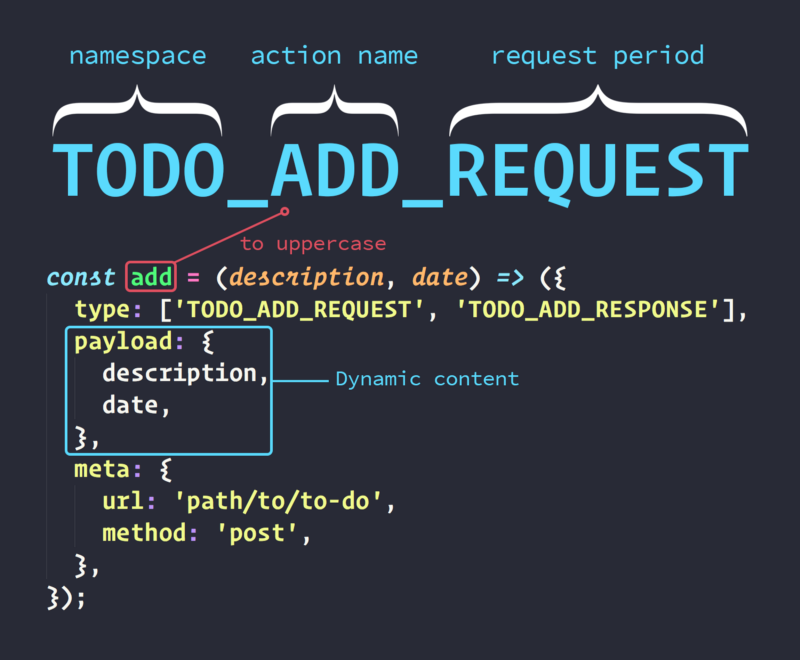
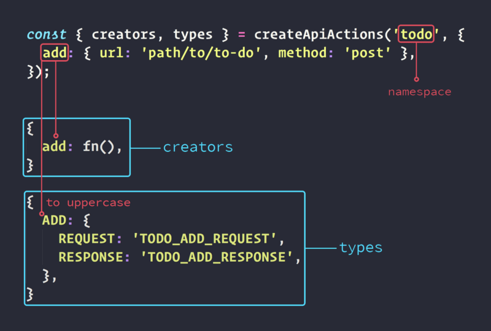
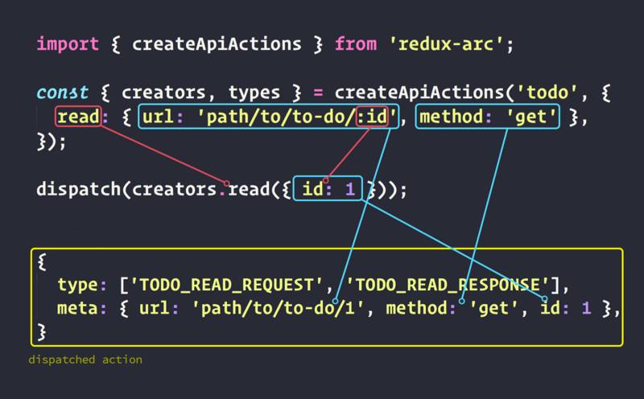
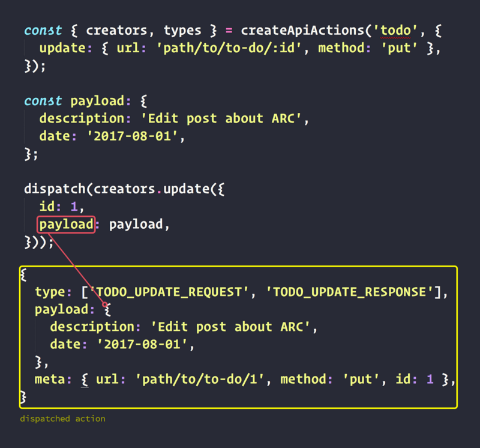

> **TL-DR:** O Objetivo desse artigo é explicar em detalhes o funcionamento do Arc. Se você está buscando somente instruções para instalação e utilização, você pode ir direto ao [README](https://github.com/viniciusdacal/redux-arc) do projeto ou na [docs](http://redux-arc.org). No entanto, é sempre bom conhecer as ferramentas que você está utilizando.

Há um ano atrás, eu escrevi [um post](https://blog.coderockr.com/requisi%C3%A7%C3%B5es-ass%C3%ADncronas-em-redux-c613a0d3ac7e) falando sobre como lidar com requisições assíncronas em _Redux_. Desde então, passei por outros projetos e acabei utilizando outras tecnologias. Das dificuldades que enfrentei nesse processo, eis que surgiu a ideia de criar uma lib que abstraísse a parte chata do processo, algo que eliminasse a repetição de código mas que ao mesmo tempo fosse flexível e escalável, permitindo ao desenvolvedor investir seu tempo onde realmente interessa. Foi assim que nasceu o [_Arc_](https://github.com/viniciusdacal/redux-arc).

O _Arc_ é uma lib de 2kb, totalmente livre de dependências e com 100% de cobertura de testes.

É possível separarmos ele em duas partes independentes:

*   Factory de **types** e **creators.**
*   **AsyncMiddleware**.

### Conceitos

Primeiramente, vamos aos conceitos bases do Arc, para conseguir um entendimento melhor de como a lib funciona e o que ela realmente faz.

#### Action creator

Um **action creator** é uma função utilizada para criar **actions**. Um action creator nos permite centralizar a criação de determinado tipo de **action**, o que nos ajuda a ter uma consistência dentro da aplicação. Segue abaixo um exemplo de um **action creator**:

Com base no **action creator** acima, para obter uma **action** ADD\_TODO, bastaria executar a função **addTodo**, passando **description** e **date**, como no exemplo abaixo:

#### Async Actions

Uma **async action**, é uma **action** que descreve como será um request. Abaixo segue um exemplo de uma **async action** do _Arc_:

A primeira coisa diferente que podemos notar é o **type**. O type de uma **action**, normalmente é uma string e no nosso caso, temos um array com dois types, um para o início do request e outro para quando o fim do mesmo.

Outra coisa que podemos observar, é que temos um objeto **meta**, que possui um atributo **url** e outro atributo **method**. A **url** seria o endpoint para o request e o **method** é o método que será utilizado para efetuá-lo (**get**, **post**, **put**, **delete**).

Por último, temos o **payload,** que será  o conteúdo do request. No último exemplo de código, estamos criando um novo item **_to-do_**_,_ e o serviço em questão está esperando **description** e **date** como parâmetros.

**Caso você precise que algum dado adicional seja enviado na action, você pode incluí-lo dentro do meta.**

{
 **...**
  **meta**:**{**
    url,
    method,
    **anyOtherParam,
  },**
}

> O Arc segue o padrão flux-standard-action para definir suas actions. A leitura do [README](https://github.com/acdlite/flux-standard-action) é bem simples e pode sanar possíveis dúvidas sobre a decisão do formato que nos baseamos para definir as actions do Arc.

A **async action** é apenas um padrão, ela sozinha não faz o request. Quem fica responsável por isso é o **async middleware**, que interpreta a **async action** e toma as ações necessárias.

#### Middleware

Um **middleware** é uma função que faz parte de uma corrente de funções, que levam informação de um ponto a outro, podendo ou não modificar a mesma.

No _Redux_, os dados que trafegam dentro dos **middlewares**, são as **actions**. Sendo assim, dentro de um **middleware** você pode alterar o conteúdo de uma **action**, ou simplesmente interceptá-la e retirá-la do fluxo da aplicação.

Um **middleware** em _Redux_, é uma função que deve possuir a seguinte assinatura:

No _Redux_, os **middlewares** são executados todas as vezes que uma **action** for disparada dentro da aplicação. Dentro dele, temos acesso à um objeto **store**, que contém o método **getState** e o método **dispatch**, os quais podemos utilizar para interagir com o **state**.

Recebemos um método **next**, que deve ser executado passando a **action** como parâmetro, para dar continuidade ao fluxo dos **middlewares**.

Por último, recebemos a **action** que foi disparada.

Observe que para modificar o conteúdo de uma **action** dentro do **middleware**, basta criar um novo objeto a partir da **action** que recebemos, mudar o seu valor e executar o método **next** passando o novo objeto:

const middleware = store => next => action => {
  const newAction = {
    ...action,
    payload: anyNewPayload,
  };

  next(newAction);
};

Para interceptar uma **action**, basta não chamar o método **next:**

const TYPE\_TO\_INTERCEPT = 'X';

const middleware = store => next => action => {
  if (action.type === TYPE\_TO\_INTERCEPT) {
    return;
  }
  next(newAction);
};

No exemplo acima, interceptamos todas as actions com o type `X`.

Consegue entender as possibilidades que um middleware nos dá? Não? Não se preocupe, tudo ficará claro mais a frente!

### Async Middleware

Uma vez que temos a definição da **async action**, precisamos ter um **middleware** que a entenda e que efetue os requests conforme seus dados.

Abaixo, segue um exemplo do que seria um **async middleware**.

Basic async middleware example

> O exemplo acima está utilizando axios, mas no Arc, você pode escolher qualquer lib que desejar, ou até mesmo implementar em vanilla js o seu request.

Logo no início do **middleware**, já verificamos se o atributo **type** é um array. Caso não for, apenas executamos a função **next**, com a **action** em questão, para a deixarmos seguir seu fluxo natural.

Caso o **type** seja um array, assumimos que o objeto em questão é uma **async** **action**. Sendo assim, nós extraímos as duas strings, **resquestType** e **responseType** e os objetos **payload** e **meta:**

const \[**requestType**, **responseType**\] = action.type;

const { **meta**, **payload** } = action;

Antes de iniciar o request, nós disparamos uma **action**, cujo **type** é o **requestType** e também injetamos nela o **payload** e o **meta**. Dessa forma, fica fácil ter acesso a todos os dados relevantes ao inicio do request quando estivermos dentro do reducer:

store.dispatch({ type: **requestType**, **payload, meta** });

Depois de disparar a primeira **action**, nós efetuamos o request, utilizando **url e method** do **meta** e também o **payload:**

axios\[meta.**method**\](meta.**url**, **payload**)

Uma vez que o request é finalizado, nós disparamos a segunda **action**, contendo como **type** o **responseType** e também acrescentamos a ela, o **meta**.

Em caso de sucesso, o **payload** da **action**, será o resultado do request:

dispatch({
  type: **responseType**,
  payload: **response**,
  **meta**,
});

Em caso de erro, o **action.payload** passa a ser o erro do request e nós atribuímos o valor **true** para **action.error:**

dispatch({
  type: **responseType**,
  payload: **error**,
  error: **true**,
  **meta**,
});

Com o **async middleware** nós já conseguimos eliminar muito do nosso trabalho quando se trata de fazer requisições. Porém, uma parte do trabalho ainda fica muito mecânica e repetitiva: A criação dos **types** e **action creators** para cada novo tipo de request.

Considerando uma api RESTFul, os **types** e **actions creators** para um CRUD, ficariam da seguinte forma:

Se pararmos para observar, conseguimos encontrar inúmeros padrões que sempre se repetem. Vamos observar o código referente apenas a ação de adicionar um to-do:

*   Os **types** são sempre em uppercase, compostos por: **namespace**, **ação do request** e pelo **momento do request.**
*   O nome do action creator é o nome da ação do request.
*   O payload será sempre o conteúdo do request e ele que é o conteúdo dinâmico da action.

A url também precisa ser dinâmica de certa forma, para podermos passar parâmetros nela quando necessário, como um `id`, por exemplo.

Levando os pontos acima em consideração e inpirado pelo [_redux-sauce_](https://github.com/infinitered/reduxsauce)_,_ cheguei a seguinte ideia : E se pudéssemos definir o nome das **actions**, informar suas respectivas **urls** e **métodos**, e uma função nos devolvesse os **types** e os **action creators?** Algo que fosse declarativo e que permitisse que nossas configurações fossem validadas. Isso reduziria a possibilidade de erros por parte do desenvolvedor e aumentaria muito a sua produtividade. Com base nisso, escrevi uma interface para definição dos requests:

No exemplo acima, temos a configuração de um request para a criação de um item de **to-do**. Definimos o nome da ação, a respectiva **url** e o **método** do request. Na imagem abaixo, podemos ver um exemplo do retorno da função **createApiActions**:

> O nome da action e o namespace devem ser fornecidos sempre no padrão [lower camelcase.](http://wiki.c2.com/?LowerCamelCase)

A função **createApiActions**, retorna os **creators** e os **types** referente aos requests que foram configurados. Um **creator** aceita como parâmetro um objeto, que pode conter:

*   Um **payload**, que se tornará o **payload** do request e da **action.**
*   Qualquer parâmetro extra, que se tornará parte do **meta** da **action** _e também será utilizado para converter urls dinâmicas._

Sendo assim, para iniciar um request , basta utilizar o **creator** com o **dispatch**, como abaixo:

E então, a seguinte **action** seria disparada:

### URLs dinâmicas

Nos exemplos acima, utilizamos URLs estáticas, que não suprirão todas as nossas necessidades. Por esse motivo, no _Arc_ é possível configurar URLs dinâmicas, que aceitarão parâmetros como parte de si.

Para fazer uso delas, basta inserir `:` e o nome do parâmetro na definição da url, como no exemplo abaixo:

{ **url:** path/to/to-do/**:id,** method: 'anymethod' }

Para converter os parâmetros que foram definidos na url, serão utilizados os valores passados para o **action creator**, como no exemplo abaixo:

Acima, configuramos os requests: **read**, **update** e **otherDynamicUrl**. Depois de defini-los, nós os utilizamos passando para eles um objeto que contém os valores necessários para converter a url. Abaixo segue uma explicação detalhada da **action** **read**:

Como podemos ver na imagem acima, o Arc utiliza o parâmetro `id` que foi passado para o **creator**, para converter a **url**. O Arc também pega todos os parâmetros, com excessão do **payload,** e os injeta dentro do **meta** da **action**. Por essa razão, é possível ver que dentro do **meta** da **action** disparada, além de termos a **url** e  o **method,** nós temos o **id**.

Na imagem abaixo, podemos ver uma explicação da **action** **update**:

Acima, é possível ver que podemos passar tanto um parâmetro para a url, quanto o payload da action.

Com base na configuração do arc, o nosso crud ficaria da seguinte forma:

Se compararmos o código acima com o exemplo anterior de crud, conseguimos uma economia de 55 linhas, e um código consideravelmente mais simples.

### Types e Tratamento de erros

Os types retornados da função **createApiActions** podem ser utilizados dentro dos reducers, como no exemplo abaixo:

No exemplo acima, estamos cobrindo todos os momentos do requests e também estamos tratando os erros.

De acordo com o exemplo acima, podemos utilizar a **action** referente ao ínicio do request para alterar o state, indicando que há um request em andamento.

Quando a **action** referente ao fim do request for disparada, o resultado do request virá dentro de **action.payload** em caso de successo.

Quando houver um erro, **action.error** será **true** e o **action.payload** será o erro em si.

### Instalação

Para integrar o Arc a um projeto _Redux_, é bem simples:

Conforme o exemplo acima, primeiro precisamos importar a função **createAsyncMiddleware**. Depois executamos essa função passando para ela a função que fará o request. Por último, pegamos **middleware** que a função retornou e aplicamos ele na store.

#### asyncTask

Para maior flexibilidade, o _Arc_ espera que você forneça a função responsável por efetuar o request. No exemplo acima, utilizamos o axios, mas você pode utilizar qualquer outra lib. O objeto **options** virá com a **url**, o **method** e o **payload** para o request. Uma vez que o request terminar, basta executar a função **done**, passando o **error** e o **response**.

Até aqui, abordamos a maioria dos casos de uso referente a requisições. Porém, há alguns cenários que não cobrimos, como quando precisamos alterar o formato dos dados antes do request, ou quando precisamos modificar o valor do response, ou tomar determinada ação assim que o request terminar. Para todos esses casos, o Arc tem as **policies**.

### Policies

Policies são middlewares que você define e registra dentro do _Arc_. Uma vez registrada, a **policy** pode ser passada na configuração do request, como no exemplo abaixo:

Primeiro, definimos uma **policy** chamada **anyPolicy.** Toda **policy** deve respeitar a seguinte assinatura:

function PolicyName(store) {
  done => (action, error, response) => {
    done(action, error, response)
  };
}
PolicyName.applyPoint = 'beforeRequest' or 'onResponse';

Na linha 8, estamos definindo o **applyPoint** da **policy**, que é obrigatório. Eles indicam em qual ponto do request a **policy** será executada. Os **applyPoints** disponíveis são: **beforeRequest** e **onResponse**.

Na linha 9, nós registramos a **policy** no _Arc_, utilizando o método  **register**. Fazendo isso, a **policy** já está disponível para uso em qualquer request.

Para utilizar as policies, conforme a linha 15, basta definir um parâmetro **policies** na configuração do request e passar um array com as policies que você deseja aplicar ao request.

O exemplo acima nos da uma ideia de como definir e utilizar uma **policy**, agora imagine que você precise salvar os dados de um to-do, mas você não quer definir dois requests para isso. Você quer definir um request **save**, que tenha as configurações de **create** ou **update**, conforme o payload fornecido. Isso poderia ser facilmente resolvido com uma **policy**, conforme abaixo:

Na **policy** acima, nós recebemos a **action** e a clonamos para evitar mutabilidade de dados.

Nós verificamos se o **payload** da action contém um **id** e  caso positivo, nós consideramos que a ação em questão é um **update**. Nesse caso, nós acrescentamos o **id** à **url**, mudamos o **method** para **put** e removemos o **id** do **payload**. Por último, passamos a nova **action** para frente.

Observe que o **applyPoint** que utilizamos foi o **beforeRequest**, porque precisamos mudar um conteúdo da action antes que o request inicie.

A **policy** acima, seria utilizada da seguinte maneira:

> Observe que nós tivemos que importar o arquivo da policy para que o código dela seja executado e ela seja registrada. Não é necessário importar o arquivo em cada lugar que você for utilizar a policy. O ideal é que você centralize as importações das policies em um único arquivo, que você pode colocar próximo dos arquivos de configuração da store, por exemplo.

Primeiro definimos nosso request com o nome de **save** e passamos a **url** sem o id. Definimos o **method** como **post**, que será utilizado para fazer o **create**, e incluímos a **policy** **createOrUpdate** ao request.

Também podemos ver a utilização de **creators.save** nos dois casos: Criação e edição.

Há casos que você precisa alterar o response ao invés do request. Para esses casos, basta utilizar o **applyPoint** `onResponse`. Dentro da policy, clone o response, modifique os dados e passe adiante utilizando a função **done.**

### Conclusão

Como vimos acima, o ARC consegue reduzir muito o boilerplate quando se trata de fazer requests e ao mesmo tempo, dá flexibilidade ao desenvolvedor. As policies por sua vez, permitem que você estruture e organize edge cases de uma forma clara e fácil.

Você pode ir adiante e dar uma espiada no [código do Arc](https://github.com/viniciusdacal/redux-arc). Contribuições são bem vindas, inclusive com a documentação.

Gostou do post e achou útil? Dê um **like** ❤️ abaixo para ajudar na divulgação e para que mais pessoas tenham acesso :)
