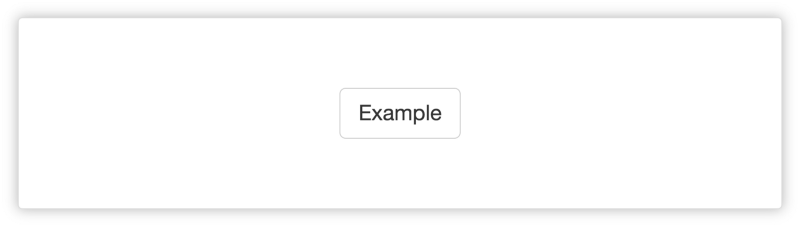
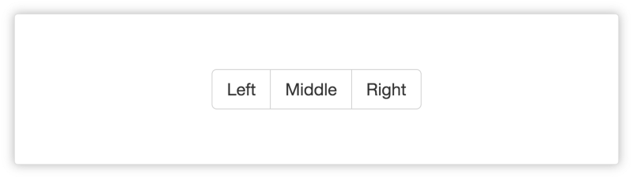

Iniciando com React - #1 Introdução

React é uma biblioteca Javascript do Facebook para a construção de interfaces web. No mercado desde 2013, vem sendo utilizada por aplicações de alto escala. Entre as principais empresas que adotaram e apostam na _lib_, estão Facebook, AirBnb, Instagram e Twitter. Por muitas vezes mencionado como o **V** do [_MVC_](https://pt.wikipedia.org/wiki/MVC), o React se propõe a controlar a camada da **View**, proporcionando total liberdade para o programador tomar decisões em relação ao resto da arquitetura da aplicação.

> Nota: Este post faz parte da serie “Iniciando com React”.
> [Próximo >](https://medium.com/@viniciusdacal/iniciando-com-react-2-criando-a-estrutura-do-projeto-2c3b0f8e9f9)

### Interface Declarativa

O React permite que nós construamos interfaces interativas de uma maneira fácil e elegante. Com ele, é possível desenvolver **Views** que são renderizadas de acordo com cada estado da aplicação. Ele se responsabiliza por renderizar e atualizar somente o necessário, o que lhe dá um ganho de performance em comparação a Frameworks mais antigos que reconstruíam todo o _HTML_ a cada alteração no estado. Sua forma declarativa de criar componentes, torna nosso código mais previsível e fácil de debugar.

Abaixo segue um exemplo da definição de um componente que chamaremos de **Button**:

Definição de um componente chamado Button.

Componente Button renderizado.

> Em um próximo post, abordaremos [os passos para criar um componente](https://blog.coderockr.com/iniciando-com-react-3-criando-componentes-97f7023ca5ab) e explicaremos em detalhes cada item que compõe o código acima.

### Componentes

Somos levados a repensar o desenvolvimento de nossas aplicações de modo que toda a interface seja baseada em componentes. É possível construir componentes simples que gerenciam seu próprio estado e utilizá-los para compor componentes mais complexos. Desse modo, é possível levar a reutilização de código a um novo nível. A lógica dos componentes é toda escrita em Javascript e não em templates, isso nos permite manter separados o estado da nossa aplicação do [_DOM_](https://developer.mozilla.org/pt-br/docs/DOM/Referencia_do_DOM).

Segue abaixo um exemplo da definição de um componente **GroupButton**, que reutiliza o componente **Button** que vimos acima:

Definição do componente GroupButton que reutiliza Button.

Componente GroupButton renderizado.

### Desacoplamento

Como dissemos anteriormente, o React se responsabiliza somente pela **View** e não opina sobre o resto das tecnologias utilizadas. Sua natureza síncrona e sua propagação de dados unidirecional, permite que ele seja facilmente integrado a outras _libs_.

### Conclusão

Com essas características, o React se faz uma ótima escolha para construção de aplicações robustas que dependem de manutenibilidade, escalabilidade e perfomance. Inúmeras empresas estão construindo ou migrando suas aplicações para essa tecnologia, por conta disso o mercado tem se mostrado bem aquecido e semanalmente aparecem anúncios de vagas para profissionais que conhecem a biblioteca.

No [próximo post](https://blog.coderockr.com/iniciando-com-react-2-criando-a-estrutura-do-projeto-2c3b0f8e9f9) aprenderemos a criar a estrutura básica de um projeto React.

Gostou do post e achou útil? Dê um **like** ❤️ abaixo para ajudar na divulgação e para que mais pessoas tenham acesso :)
