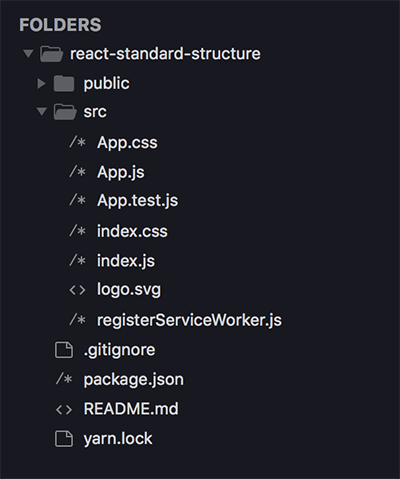
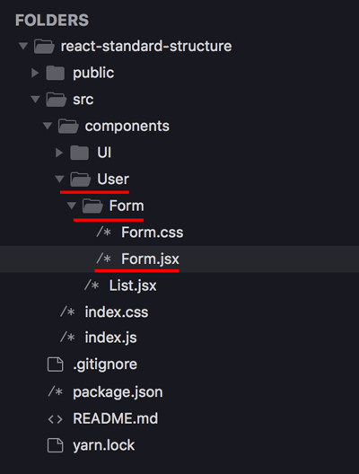

Por ser somente uma lib, o React não dita muitas regras em como você deve organizar e estruturar seus projetos. Isso é muito legal, pois nos dá a liberdade de experimentar abordagens e ir adaptando a que melhor se encaixa para nós. Por outro lado, isso gera bastante dúvidas na cabeça de quem tem pouca experiência com a lib.

Nesse post veremos algumas abordagens que venho utilizando há algum tempo e que tem escalado muito bem. Essas abordagens não reinventam a roda, elas apenas reunem e refinam o que vemos no mercado.

### Estrutura de pastas

Uma das dúvidas frequentes que vejo, é em relação a estruturação de arquivos e pastas. Neste post partiremos do ponto onde você possui uma estrutura mínima como a criada pelo `create-react-app`.

O `create-react-app` gera para nós um projeto básico, contendo em sua raiz os arquivos _.gitinore_, _package.json_, _README.md_, _yarn.lock_, e também gera as pastas _public_ e _src_, onde manteremos o source code da nossa aplicação. Observe a imagem abaixo com a estrutura descrita:



Nesse post iremos focar na pasta _src_ e tudo que estiver fora dela permanecerá intacto.

### Containers e Components

Em inúmeros projetos, você já deve ter visto a separação entre _Containers_ e _presentational components_ na raiz do projeto. Ou seja, dentro de _src_, você tem uma pasta chamada _components_ e outra pasta chamada _containers:_

```
src├─ components
```

Porém, esse tipo de abordagem tem alguns problemas, que listaremos abaixo:

*   **Regras subjetivas** - É difícil criar regras claras para definir o que é um _container_ e o que é um _presentational component_. A definição de um e de outro pode ser muito subjetiva e quando você está trabalhando em um time, será difícil todos os desenvolvedores terem a mesma opinião e julgamento para diferenciar um do outro.
*   **Desconsidera o dinamismo dos componentes** - Mesmo quando é decidido que um componente se encaixa em um dos tipos específicos, é muito fácil que ele sofra mudanças ao longo do projeto, se tornando de outro tipo e forçando você a ficar movendo ele da pasta _components_ para a pasta _containers_ e vice-versa.
*   **Permite que dois componentes tenham o mesmo nome -** Componentes devem ter nomes declarativos e únicos dentro do sistema, para evitar confusão sobre a responsabilidade e utilização de cada um. Porém a abordagem acima abre uma brecha para que você tenha dois componentes com o mesmo nome, sendo um do tipo _container_ e outro do tipo _presentational_.
*   **Perda de produtividade** - Você precisa ficar navegando constantemente entre a pasta _containers_ e a pasta _components_ mesmo quando está trabalhando em uma única feature da aplicação. Pois é comum que uma mesma feature tenha os dois tipos de componentes.

Também existe uma variação da abordagem acima, que busca manter essa separação, porém, dentro de cada modulo/feature do projeto.

Imagine que dentro da sua aplicação você possui o modulo User. Dentro dele, você teria as duas pastas para separar seus componentes:

```
src└─ User  ├─ components  └─ containers
```

A abordagem acima reduz um pouco o problema de ficar navegando entre distintas arvores de pastas dentro do projeto. Por outro lado, ela gera muito ruído. Dependendo de quantos módulos a aplicação tiver, você vai acabar com dezenas de pastas com nomes _containers_ e _components._

Por esses motivos, quando se trata de organização de pastas e arquivos, é irrelevante separarmos os nossos componentes pelo conceito de _presentational_ vs _container_. Sendo assim, manteremos todos nossos componentes dentro da pasta _components_, abrindo uma excessão apenas para as _screens._

> Mesmo sendo irrelevante separá-los em pastas, é importante que você saiba a diferença conceitual entre um tipo e outro. Caso você ainda tenha dúvidas sobre esse conceito, eu sugiro a leitura do post: [Presentational and Container Components.](https://medium.com/@dan_abramov/smart-and-dumb-components-7ca2f9a7c7d0)

### Separação e agrupamento de códigos

Dentro da pasta components, nós agrupamos os arquivos por módulo/feature.

Em um [_CRUD_](https://pt.wikipedia.org/wiki/CRUD) de usuários, teríamos apenas o módulo User. Sendo assim, nossa estrutura ficaria da seguinte maneira:

```
src└─ components  └─ User
```

Quando um componente é composto por mais de um arquivo, colocamos esse componente e seus arquivos em uma pasta com o mesmo nome. Por exemplo: Digamos que você possua um _Form.css_ com os estilos do _Form.jsx_. Nesse caso nossa estrutura ficaria assim:

```
src└─ components  └─ User    ├─ Form    │ ├─ Form.jsx    │
```

> Os arquivos de testes sempre acompanham o arquivo que está sendo testado. No caso acima, o teste para o **Form.jsx** ficaria na mesma pasta do arquivo em questão e seria nomeado como: **Form.spec.jsx**

#### UI Components

Além da separação dos módulos, também incluímos uma pasta _UI_ dentro de `src/components`, e dentro dela incluímos todos os componentes genéricos da aplicação.

_UI Components_ são componentes genéricos o suficiente para não pertencer a nenhum módulo. São componentes que você conseguiria manter em uma lib open source, externa ao projeto, pois eles não possuem nenhuma regra de negócio da aplicação em específico. Exemplos de componentes assim são: Buttons, Inputs, Checkboxes, Selects, Modais, Elementos de apresentação de dados e etc…

### Nomeando componentes

Acima nós vimos como estruturar nossas pastas e separar nossos componentes por módulos, porém, ainda há a questão de como nomear nossos componentes.

> Quando estamos falando de nomear o componente, se trata apenas do nome que damos à **class** ou à **const** que define o componente:

> class **MyComponent** extends Component {
> }
> const **MyComponent** () => {};

Como mencionado anteriormente, o nome dado aos componentes deve ser claro e único dentro do sistema, a fim de facilitar sua localização e evitar possíveis confusões. O nome do componente é muito útil quando precisamos inspecioná-lo utilizando ferramentas como o React Dev Tools, e também é muito útil quando ocorre algum tipo de erro na aplicação, o erro sempre vem com o nome do componente onde ele ocorreu.

Para nomear os componentes, nós seguimos o padrão _path-based-component-naming_, que consiste em você nomear o componente de acordo com a sua localização em relação à pasta _components,_ ou à pasta _src_ caso o componente esteja fora da pasta components. Basicamente, um componente que se encontra no path: `components/User/List.jsx` seria nomeado como `UserList`.

Quando o arquivo está em uma pasta de mesmo nome, nós não precisamos repetir seu nome. Sendo assim, `components/User/Form/Form.jsx`, será nomeado como `UserForm` e não como `UserFormForm`.

Esse padrão possui alguns benefícios conforme listados abaixo:

#### Facilita a busca do arquivo dentro do projeto

Se o seu editor possui fuzzy search, procurando o arquivo pelo nome `UserForm` você encontrará facilmente o arquivo correto:


Se você fosse procurar o arquivo navegando na arvore de pastas, você consegue encontrá-lo apenas se orientando pelo nome:



#### Evita repetição de nomes na importação

Seguindo esse padrão, você sempre nomeará o **arquivo** de acordo com o contexto que ele se encontra. No caso do nosso **form**, ele é um **user form**, mas como já estamos dentro da pasta User, não precisamos repetir essa palavra no nome do **arquivo**. Sendo assim, o arquivo em si se chamará apenas **Form.jsx**.

Quando comecei a trabalhar com o React, eu costumava colocar o nome completo no arquivo. Porém, isso pode te levar a repetir um nome muitas vezes e o caminho de importação se torna enorme. Observe a comparação entre um padrão e outro:

import **ScreensUserForm** from '**./screens/User/UserForm**';
// vs
import **ScreensUserForm** from '**./screens/User/Form**';

No exemplo acima é difícil enxergar vantagens de um em relação ao outro. Porém, a aplicação ficando um pouco maior, já é possível notar a diferença. Observe o exemplo abaixo de um dos componentes do projeto em que eu trabalho:

import MediaPlanViewChannel from '/MediaPlan/MediaPlanView/MediaPlanViewChannel.jsx';

// vs

import MediaPlanViewChannel from './MediaPlan/View/Channel';

Por esses motivos, sempre nomeamos o **arquivo** de acordo com o contexto que ele se encontra e nomeamos o **componente** de acordo com sua localização em relação a pasta _src_ ou a pasta _components_.

### Screens

Screens, como o próprio nome já da a entender, seriam as telas que temos dentro da nossa aplicação.

Em um _CRUD_ de usuários, teríamos uma tela para a listagem, uma para a criação e uma tela para a edição. Cada uma dessas telas, seria uma screen.

Uma screen é onde você utiliza os componentes para compor uma tela. Quanto menor a estrutura da screen, melhor. Idealmente, ela não conterá nenhum tipo de lógica e será um [_functional component_](https://blog.coderockr.com/iniciando-com-react-3-criando-componentes-97f7023ca5ab#f779)_._

Por padrão, nós mantemos as screens em uma pasta separada, na raiz da pasta _src_, pois elas devem ser organizadas de acordo com a definição de rotas e não por módulos:

```
src├─ components
```

Considerando o gerenciador de rotas sendo o react-router, nós mantemos um arquivo _Root.jsx_ dentro da pasta _screens_ e nele nós definimos todas as rotas da aplicação. O código do _Root.jsx_ seria similar ao abaixo:

Observe que colocamos todas as screens dentro de uma pasta com o mesmo nome da rota, `user/ -> User/`. Procure manter uma pasta para cada parent route, agrupando suas sub-rotas. Nesse caso, criamos a pasta`User` e mantemos as screens List e Form dentro dela. Esse padrão ajudará você a encontrar facilmente qual screen está renderizando cada rota, apenas de olhar em uma url.

Uma mesma screen pode ser utilizada em duas rotas diferentes, como fizemos acima com as rotas para criação e edição do usuário.

Pode ser que você tenha notado que todos os componentes tem um prefixo Screens no nome. Quando o componente é criado fora da pasta _components_, devemos nomeá-lo de acordo com a sua localização em relação a pasta _src_. Sendo assim, `src/screens/User/List` se torna `ScreensUserList`.

Já com o _Root.jsx_ criado, a estrutura de pasta estaria da seguinte forma:

```
src├─ components
```

> Não esqueça de importar o Root.jsx dentro do index.js para servir como o root component da aplicação

Se você ainda tem dúvidas em relação a construção de uma screen, segue abaixo o que seria o código da screen user form:

E por fim, nossa aplicação ficaria estruturada da seguinte forma:

```
src├─ components
```

### **Recapitulando**

*   **Presentationals** e **Containers** components são mantidos na pasta `src/**components**`
*   Agrupamos nossos componentes por **módulo/feature.**
*   Mantemos componentes genéricos dentro da pasta `src/**components**/**UI**`
*   Construímos **screens** com uma estrutura mínima utilizando outros componentes.
*   Agrupamos nossas **screens** de acordo com a definição de rotas. Sendo assim, para uma rota `/user/list` teríamos a screen localizada em `/src/screens/User/List.jsx`.
*   Componentes são nomeados de acordo com a sua localização em relação a pasta `src` ou a pasta `components`. Sendo assim, um componente localizado em `/src/components/User/List.jsx` seria nomeado como `**UserList**`. Um componente localizado em `/src/screens/User/List` seria nomeado como `**ScreensUserList**`.
*   Componentes que estão em uma pasta de mesmo nome, não precisam repetir o nome no componente. Sendo assim, um componente localizado em `/src/components/User/List/List.jsx` seria nomeado como `**UserList**` e não como `UserListList`.

### Conclusão

As dicas acima cobrem apenas uma fatia do assunto referente a organização e estruturação de projetos. Tentei me ater apenas a parte que se refere ao _React_ e deixei a parte referente ao _Redux_ para um próximo post.

E você, tem alguma dica que gostaria de compartilhar ou tem algo a acrescentar ao artigo? Escreva uma resposta abaixo :)

Gostou do post? Ajude-nos a divulgar dando um like e compartilhando nas redes sociais para que mais pessoas tenham acesso! ❤️️

Não esqueça de clicar em seguir para não perder os próximos posts.
