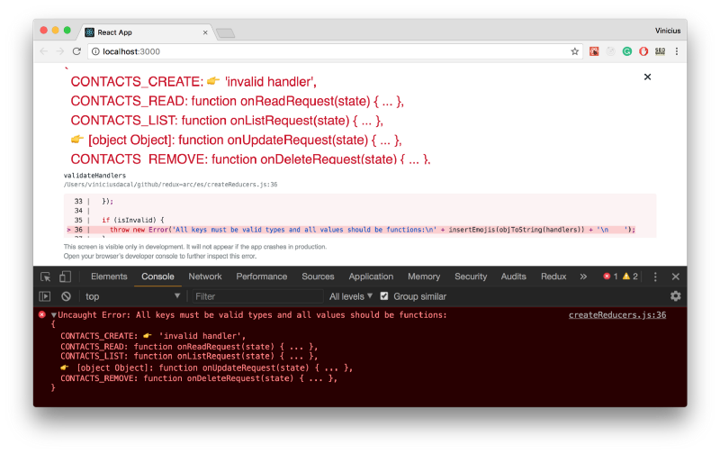

Redux is awesome! But people often complain about how much boilerplate they have to write when working with it. Part of this problem, is because they feel unproductive defining _constants_, _action creators_ and big _reducers_, but also because they don’t have a clear idea on how to organize their project, or even how to proper handle async requests. On this post, we are going to talk about those concerns and present some approaches to handle them.

### About Redux Arc

_Arc_ is a tiny and well tested lib to help you to be productive on your daily work with Redux. It has utilities to abstract the creation of _action types_, _action creators_, _reducers_ and it also has an elegant way to manage _async requests_. It’s also worth mentioning that it has been used for almost a year in production, without regretting a single day!

First things first, let’s talk about creating actions!

### The process about creating actions

When we are talking about _Redux_, usually, the first step we take when we are going to create a new feature is: Create **_action types_** and **_action creators_**.

Let’s say we are creating a Contacts app and the first feature we have to implement is the creation of a contact. The **type** and the action **creator** for that would look like this:

Then, you import the _action type_ to use it in your reducer and import the _action creator_ to use in your component.

The above code is fine, but it’s unlikely that you would have only a **creation** feature. In a real world, you would have at least a [_CRUD_](https://pt.wikipedia.org/wiki/CRUD). So, let’s see the code for that:

The above code is very simple, but as you can see, it feels like we are repeating code. If it feels like that in a Contacts CRUD, imagine in an application with dozen of modules.

If you are familiar with _DRY_, you know we should avoid code repetition. You may say we are not repeating code, because each creator has it’s own “business logic” and is creating a different kind of action, but I beg to disagree. If you really pay attention, you can see the patterns:

*   As we are following [**_Flux Standard Action_**](https://github.com/redux-utilities/flux-standard-action) spec, every time we want to send a content with our action, we should keep it in the `action.payload`. Any additional meta info, should go under `action.meta`. If our action indicates an error, `action.error` should be true and `action.payload` should contain the actual error.
*   we are always defining actions **types** and **creators** with the same name, the only difference is that one is uppercased and the other is camel cased.

Knowing the first pattern, we could try to normalize our creators, changing them slightly to work with the fixed arguments: `payload`and `meta`.

Let’s take the **create** action as an example, instead of having `name`, `email` and `phone` as arguments, we could have just the `payload`:

About the second pattern, the action type could be generated based on the creators name.

Now that we can normalize our **creators** and we know that the **types** could be generated based on **creator**’s name, it’s completely possible to create a factory that given a config it generates the **creators** and the **types** for us.

A factory with a simple api generating creators and types would be very handy, right? That is exactly what you have on Arc’s `createActions`:

> Click on “run” to see the output generated from `createActions`

The function `createActions` expects a namespace as its first argument and an action definition object as the second.

For the action definition object, each **key** should be the creator name and each **value** could be either, an object with the defaults for `payload`, `meta` and `error` or `null` if you don’t want any defaults.

The result will be an object, containing the **creators** and the **types** for each action.

#### Types

The types from the above config, would look just like the following:
```js

{
  CREATE: 'CONTACTS\_CREATE',
  READ:   'CONTACTS\_READ',
  UPDATE: 'CONTACTS\_UPDATE',
  REMOVE: 'CONTACTS\_REMOVE',
}
```

> Notice: the namespace we provided in the config, was used to prefix the action types value, in order to avoid having two different actions with the same name in the application**.**

Based on the above object, wherever you would like to use the type **CREATE**, you could just import the **types** object and use it such as below:

#### Creators

Based on our CRUD config, the creators object would be similar to this:
```js

const creators = {
  **create**: function (payload, meta, error) {...},
  **read**:   function (payload, meta, error) {...},
  **update**: function (payload, meta, error) {...},
  **remove**: function (payload, meta, error) {...},
};
```

Creators creates the actions using the `payload`, `meta` and `error` arguments. They are all optionals, so, you can omit them as you like.

Take a look at how we would use our **create** creator:

The creators only generates the actions, so, whenever you want to dispatch an action, you have to use it combined with the **dispatch** method from Redux store, as we are going to see below.

### Using Action Creators in the components

The most common place we use creators is inside a component connected to the store.

There’s no secret when you have to use a creators generated by arc inside a component. Take a look at the example:

As you can see in the above example, we just defined a **create** method inside **mapDispatchToProps**, to have access to **dispatch** method. Then, inside our component we would have access to **create** through the props.

this.props.create(formValues);

### Creating Reducers

As you already know, we are going to reuse the generated **types** inside our **reducers**. But, that are also other bits we have to discuss about reducers.

Redux calls all the application reducers when we dispatch an action, then, inside the reducers we have to check if the dispatched action means something to the given reducer or not.

I’ve seen many people using switch cases to handle that situation, where you match the action **type** with your **case** and you can use `default case` to return the previous state. The problem is that switch cases doesn’t scale very well, and you can end up with painful code to maintain.

I have seen also many people using multiple IFs, including me, but this approach has similar issues with the switch case’s approach.

With both approaches, you end up dealing with matching logic and state changes in the same place. That way is hard to focus in a small piece of code per time.

Thinking about that, we created a `createReducers` function in _Arc_, which accepts an **initial state** and a **handlers** object which the keys are the action types and the values are handlers for each action. Take a look at the example below:

The main idea about this approach, is having a handler for each kind of action. That way you can focus in a small chunk of code per time, instead of a function with 100 lines. It also has a better performance in comparison to IFs and switch cases, as it uses short circuit verification. Under the hood its code is similar to the following:

As you can see, there’s no magic in the code, all we are doing is verifying if there’s a handler to the given action. If we do, we just call it providing the `state` and the `action`, if we don’t, we just return the previous `state`. The difference is that you have this abstracted and tested for you, with validation as a bonus, to reduce your debugging time in case you provide an invalid action type or an invalid handler:



### Creating Async Requests

_Arc_ has also a good support to help you handle async requests as it was originally designed to do just that. I plan to explore this topic in another post, but if you are interest on this, take a look at the docs to see how you can use it: [redux-arc.js.org/#async-actions](http://redux-arc.js.org/#async-actions).

### Recap

*   The function `createAction` accepts a config and returns **types** and **creators.**
*   You can import **types** and use them with `createReducers`.
*   `createReducers` allows you to turn your reducer into small handlers.
*   You can import and use the **creators** inside your components or wherever you need to dispatch an action.

### Useful links

*   [Contacts CRUD in Redux Arc](https://github.com/redux-arc/redux-arc-demo).
*   Docs : [redux-arc.js.org](http://redux-arc.js.org).
*   [Gitub repository](https://github.com/viniciusdacal/redux-arc).

### Conclusion

Besides reducing boilerplate and allowing you to split your code elegantly, `createReducers` as well as `createActions` is all about configuration over programmatically implementation. That allows us to run validations to help you with debugging and also allows you to focus on what really meters.

You don’t want to spend time writing boilerplate or debugging your whole application just because you commit a typo.

You want to implement features and fix bugs as better and faster as it’s possible, without loose flexibility and we want to help you do that!

Any feedbacks and contributions are very welcome. Feel free to [open an issue on github](https://github.com/viniciusdacal/redux-arc/issues) to ask me more about it.

Did you enjoy the read?

️❤️ Help us spread the word by giving a like and sharing️️️️ ❤️

🖖 Don’t forget to follow me, to be notified about future posts! 🖖
