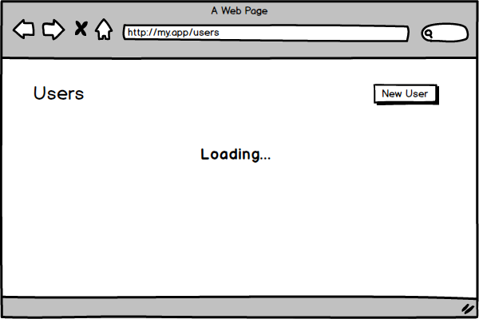
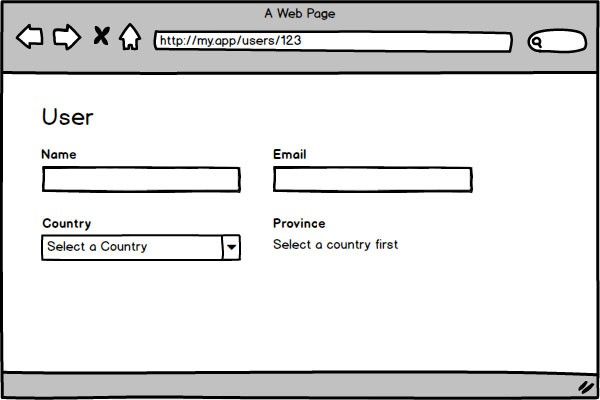

When we are developing a React application, we often need to show or hide an element given a certain condition. Be it a user interaction, the presence of data coming from a request, or even permission levels. This is called conditional rendering, and we’ll look at different approaches to handling those cases.

### IF

IF is the most basic approach of all and probably the one you will mostly see, but it is restricted to the total block of the component. You use an IF with your condition and return the element to be rendered. Observe the example below:

Above we have a list of users, who receives the `isLoading` props and `results`. If `isLoading` is true, we return a message stating that it is loading, otherwise, we render the list of users.

> Note that we **DO NOT** use **ELSE** since there is no need as we use the **return** within the first **IF**. Do not be afraid to use more than one **return** per function, this practice will help you to reduce the complexity of the code.

There is nothing wrong with the above example, on the contrary, the code is simple and readable. However, as I mentioned, this approach is restricted to rendering a whole block and in many cases, we can not use it.

Imagine that our List of users is more complex, that it has a title and a button to create a new user. In this case, the page should always show the title and button. Loading message would only appear in the place of the list, as shown below:

Considering the above image, we can not use the **IF** because we would need to repeat an entire block of code just to change the contents of the list.

For these cases, we can write an expression using the `&&` logical operator within our _JSX_, as in the example below:

As in the example above, we can use braces (`{}`) to insert a _JS_ expression inside _JSX_. React will get the result of each expression and will render on the screen. When an expression returns a `Boolean`, `undefined` or `null`, _React_ just ignores, not rendering anything!

> **React Native** will **NOT** ignore `undefined` and you end up with a run time error. Rather to convert the value to boolean in that case if you are using React outside of web environment.

#### Understanding expressions

When we use the logical operator `&&` JS will interpret each value of the expression until it reaches the last value or some of the evaluation end up in a [_falsy value_](https://developer.mozilla.org/en-US/docs/Glossary/Falsy). In any case, the last value interpreted will be the result of the expression. Example:

As in the example above, from line 7, the first element, `user`, is interpreted. Since it is a [_truthy value_](https://developer.mozilla.org/en-US/docs/Glossary/Truthy), the cursor passes to the second element, which is `user.name`. Since this is the last interpreted element, the result of the expression will be the value of the second element: `'John'`.

In the case of the `address`, the first element, `user`, is interpreted and identified as _truthy_ and then the cursor passes to the second element `user.address`, which in this case has the value of `null`. Since we have no more elements and the last value interpreted was `null`, this becomes the result of the expression.

Finally, in the case of `zipCode`, the same process as the `address` occurs. It interprets the first, then it passes to the second. However, since the second element is _falsy_, the cursor finishes the execution of the expression and, as always, assumes the last interpreted value, in this case: `null`.

It is important to understand how the expressions work, because sometimes you may be expecting the result to be `false`, and then you get `null` or `0`.

#### Readability

Since we are including logic within _JSX_, we have to be careful to maintain the readability of the code. For this reason, for expressions with more than two items, it is interesting to create a variable to abstract the validation items. An example:

{!isLoading && !results.length && (
  **NO RESULTS FOUND**
)}

// VS

const shouldDisplayNotFound = !isLoading && !results.length;

{shouldDisplayNotFound && (
  **NO RESULTS FOUND**
)}

The above example serves only to understand the concept, I know that we do not see clearly the advantages of one approach to another. That’s because we have a small block of code in front of us. But below we will see this same applied concept in a more practical way.

Let’s say for our list of users, we need to show a message when no record has been found. However, we can only display this message after the result has already been loaded. In this way, we can check the number of results through `results.length`. Below, we will see how this logic would look without using variables.

Above we see that the logic begins to get a bit complex to be in the middle of _JSX_, but we still can understand it. Basically, in all checks, we need to consider `isLoading`, to ensure that the list is loaded and only then base us on `results.length` to tell whether there are results or not.

> Note that to show the list, we checked whether the length was greater than `0`. Remember how the values of an expression are interpreted and how the result of the expression is obtained? If we just checked if the length was truthy, writing `results.length &&`, if it were `0`, that would be the result of the expression and then React would print `0` on the screen.

Considering the previous example, imagine now that besides treating a state where there are no results, you also need to display a different message if there is an error in the request. Notice what the code looks like:

Notice that the complexity begins to get bigger and it becomes difficult to understand what is happening. Let’s explore ways to simplify our code!

### Transforming Validations into Variables

As mentioned above, it is possible to take the piece from each expression that refers to the validation and extract them to variables, with declarative names. In this way, our logic will become a bit clearer. Note the code below:

We can see that extracting the logic from the middle of _JSX_, it is possible to understand it more easily, besides the variable name already make clear what the expression represents. Anyone who would maintain the code in the future could change the validations without much fear.

### Extraction of blocks

Note that in our example, most validations are centered on a single block. So, we can extract the block in question into a function, or turn it into another component, as in the example below:

Observe how all our logic got simpler by extracting the block to another component. See also that we are using again the approach of the **IFs** with the return. This approach is also known as Early return. When we use _Early return_, our logics tend to be simpler, since the next validation does not have to worry about the previous one. Ex: To check if it is loading, I do not have to worry if an error has occurred or not, since this case has already been handled in the previous **IF**.

### Use of ternary

Ternaries are also welcome in cases where two blocks alternate given a certain condition. Note the mockup below a form for user creation:

As the image above, we have the fields: Name, Email, Country and a place reserved for what would be the Province field. The Province field, requires you to select a country first. Once the country is selected, the status field will be available on the screen, according to the code below:

> Let’s not go into the `onChange` or into the logic to save the state, just assume that `values` will always have the updated value of the form fields.

Based on values, we write a ternary to display the `ProvinceSelector` if the `country` value is present, otherwise, we will display the message. The ternary is very useful, but it is not applicable everywhere. I would avoid using it to render large blocks of code, by making it difficult to read in some cases.

### Using Handlers

Handlers are also used in specific cases. When you need to render different content to the same block, all of them based on a given value.

Imagine that you are developing a generic component for presenting data. Each data has a type, which can be `date`, `number`, `currency`, etc … For each type, you need to designate a different formatting/style. For this situation, we could use handlers.

Handlers are nothing more than a key-value object, where the **key** is the unique identifier of each handler within the context and the **value** is a function that will be responsible for rendering the particular block.

In the example above, each handler receives the `value` argument, but you could receive as many arguments as you need since the handlers execution logic is implemented by you.

Note that in the `displayData` function, we get a `type` and a `value` as arguments. in line 10, we assign one of the handlers to the `const` handler, based on the `type` or assign the default handler, using a [short-circuit](https://developer.mozilla.org/pt-br/docs/Web/JavaScript/Reference/Operators/Operadores_Logicos#Short-Circuit_Evaluation) evaluation.

> Short-circuit evaluations tend to perform better than a switch case, since it evaluates only the existence of the value.

In line 11, we execute the handler passing the value and we return the result.

Finally, we execute the `displayData` function inside our `DataDisplay` component, passing the `type` and `value`.

Using other approaches to solve this kind of problem, your code could turn into chaos. In contrast, you might notice that using handlers, the example above would easily scale, rendering 10, 20, or even 30 different data types based on the type, if necessary.

### Conclusion

All of the above approaches are valid when used in the right context, it is up to us to use the super power called “Good Sense” to use each one in the appropriate situation.

And you, do you use any specific approach you would like to share with us?

Did you like the post? Help us spread the word by giving a like and sharing on social networks so that more people have access! ❤️ ️

Don’t forget to follow me, to be notified about future posts! ✌
