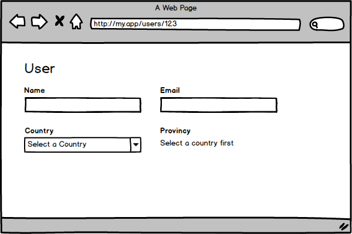

Quando estamos desenvolvendo uma aplicação React, é comum precisarmos mostrar ou esconder um elemento dada uma certa condição. Seja ela uma interação do usuário, presença de dados vindos em um request, ou até mesmo níveis de permissão. A isso é dado o nome de renderização condicional e veremos diferentes abordagens para lidar esses casos.

### IF

IF É a abordagem mais básica de todas e provavelmente a que você mais verá, porém se restringe ao bloco total do componente. Você utiliza um IF com a sua condição e retorna o elemento a ser renderizado. Observe o exemplo abaixo:

Acima, temos uma lista de usuários, que recebe as props `isLoading` e `results`. Caso `isLoading` seja true, nós retornamos uma mensagem informando que está carregando, caso contrário, renderizamos a lista de usuários.

> Observe que **NÃO** utilizamos **ELSE**, pois não há necessidade, uma vez que utilizamos o **return** dentro do primeiro **IF**. Não tenha medo de utilizar mais de um **return** por função, essa prática inclusive, te ajudará a diminuir a complexidade do código.

Não há nada de errado com o exemplo acima, pelo contrário, o código ficou simples e legível. Porém, como eu mencionei, essa abordagem se restringe a renderização de um bloco todo e em muitos casos não temos como utilizá-la.

Imagine que nossa Lista de usuários seja mais complexa, que ela possua um título e um botão para criar um novo usuário. Nesse caso, a página sempre deveria mostrar o título e o botão. Amensagem de carregamento ficaria aparecendo somente no lugar da lista, conforme a imagem abaixo:

Levando a imagem acima em consideração, não podemos utilizar o **IF**, pois precisaríamos repetir um bloco inteiro de código só para trocar o conteúdo da lista.

Para esses casos, podemos escrever uma expressão utilizando o operador lógico `&&` dentro do nosso _JSX_, conforme o exemplo abaixo:

Conforme o exemplo acima, podemos utilizar chaves(`{})` para inserir uma expressão _JS_ dentro do _JSX_. O React pegará o resultado de cada expressão e irá renderizar na tela. Quando uma expressão retorna um `Boolean`, `undefined` ou `null` o React apenas ignora, não renderizando nada!

#### Entendendo expressões

Quando utilizamos o operador lógico `&&` o JS irá interpretar cada valor da expressão, até chegar ao último valor ou algum deles retornar um [_falsy value_](https://developer.mozilla.org/en-US/docs/Glossary/Falsy)_._ Em qualquer dos casos, o último valor interpretado será resultado da expressão. Exemplo:

Conforme o exemplo acima, a partir da linha 7, o primeiro elemento, `user`, é interpretado. Como ele é um [_truthy value_](https://developer.mozilla.org/en-US/docs/Glossary/Truthy), o cursor passa para o segundo elemento, que é o `user.name`. Como esse é o último elemento interpretado, o resultado da expressão será o valor do segundo elemento: `'John'`.

No caso do `address`, o primeiro elemento, `user`, é interpretado e identificado como truthy e então o cursor passa para o segundo elemento `user.address`, que no caso tem o valor de `null`. Como não temos mais elementos e o último valor interpretado foi `null`, esse se torna o resultado da expressão.

Por último, no caso do `zipCode`, ocorre o mesmo processo que o `address`. Interpreta o primeiro, passa para o segundo. Porém, como o segundo elemento é _falsy_, o cursor termina a execução da expressão e como sempre, assume o último valor interpretado, nesse caso:`null`

É importante entender como as expressões funcionam, pois as vezes você pode estar esperando que o resultado seja `false` e de repetente recebe `null` ou então `0`.

#### Legibilidade

Como estamos incluindo lógica dentro do _JSX_, temos que ficar atentos para manter a legibilidade do código. Por esse motivo, para expressões com mais de dois itens, é interessante criar uma variável para abstrair os itens da validação. Um exemplo:

{!isLoading && !results.length && (
  **NENHUM RESULTADO ENCONTRADO**
)}

// VS

const shouldDisplayNotFound = !isLoading && !results.length;

{shouldDisplayNotFound && (
  **NENHUM RESULTADO ENCONTRADO**
)}

O exemplo acima serve apenas para entendermos o conceito, eu sei que por ele não dá pra ver vantagens de uma abordagem em relação a outra. Isso, porque temos um bloco pequeno de código na nossa frente. Mas abaixo veremos esse mesmo conceito aplicado de uma forma mais prática.

Digamos que para a nossa lista de usuários, nós precisamos mostrar uma mensagem quando nenhum registro foi encontrado. Porém, só podemos mostrar essa mensagem depois que o resultado já foi carregado. Dessa maneira, podemos verificar o número de resultados através do `results.length`. Abaixo, veremos como ficaria essa lógica sem utilizar variáveis.

Acima vemos que a lógica começa a ficar um pouco complexa para estar no meio do _JSX_, mas ainda assim conseguimos entendê-la. Basicamente, em todas as verificações, precisamos considerar o `isLoading`, para garantir que a lista esteja carregada e só então nos basear em `results.length` para dizer se há ou não resultados.

> Observe que para mostrar a lista, verificamos se o length era maior que `0`. Lembra de como os valores de uma expressão são interpretados e como é obtido o resultado da expressão? Se verificássemos apenas se o length era truthy, escrevendo`results.length &&` , caso ele fosse `0`, seria esse o resultado da expressão e então o React iria imprimir `0` na tela.

Considerando o exemplo anterior, imagine agora, que além de tratar um estado em que não há resultados, você também precise mostrar uma mensagem diferente, caso houver um erro no request. Observe como ficaria o código:

Observe que a complexidade começa a ficar cada vez maior e fica dificil de entender o que está acontecendo. Vamos explorar maneiras de simplificar o nosso código!

### Transformando as validações em variáveis

Como mencionado acima, é possível pegar o trecho de cada expressão que remete a validação e extraí-los para variáveis, com nomes declarativos. Dessa maneira, nossa lógica ficará um pouco mais clara. Observe o código abaixo:

Podemos observar que extraindo a lógica do meio do _JSX_, é possível entendê-la mais facilmente, além de o nome da variável já deixar claro o que a expressão representa. Qualquer pessoa que fosse dar manutenção no código no futuro, poderia alterar as validações sem muito receio.

### Extração de blocos

Observe que no nosso exemplo, a maior parte das validações está centralizada em um único bloco. Sendo assim, podemos extrair o bloco em questão para dentro de uma função, ou então transformá-lo em outro componente, como no exemplo abaixo:

Observe como toda nossa lógica ficou mais simples extraindo o bloco para outro componente. Observe também, que voltamos a utilizar a abordagem dos **IFs** com o **return**. Essa abordagem também é conhecida como Early return. Quando você utiliza o Early return, as suas lógicas tendem a ser mais simples, uma vez que a próxima validação não precisa se preocupar com a anterior. Ex: Para verificar se está carregando, eu não preciso me preocupar se ocorreu um erro ou não, pois esse caso já foi tratado no **IF** anterior.

### Utilzação de ternários

Ternários também são bem vindos em casos onde dois blocos se alternam dada uma certa condição. Observe o mockup abaixo de um formulário para a criação de usuário:

Formulário para criação de usuário

Conforme a imagem acima, temos os campos: Nome, E-mail, País e um lugar reservado para o que seria o campo estado. O campo estado(Provincy), exige que você selecione um país primeiro. Assim que o país é selecionado, o campo estado ficará disponível na tela, conforme o código abaixo:

> Não vamos adentrar no funcionamento do `onChange` ou do objeto `values`, apenas assuma que `values` sempre terá o valor atualizado dos campos do formulário.

Com base no values, escrevemos um ternário para mostrar o `ProvincySelector` caso o valor `country` esteja presente, caso contrário, mostramos a mensagem. O ternário é muito útil, porém não é aplicável em todos os lugares. Eu evitaria utilizá-lo para renderizar grandes blocos de código, por dificultar a leitura em alguns casos.

### Utilizando Handlers

Handlers também são utilizados em casos específicos. Quando você precisa renderizar diferentes conteúdos para um mesmo bloco, todos eles baseados em um dado valor.

Imagine que você está desenvolvendo um componente genérico para apresentação de dados. Cada dado tem um tipo, que pode ser `date`, `number`, `currency`, etc… Para cada tipo, você precisa designar uma formatação/estilo diferente. Para essa situação, poderíamos utilizar handlers.

Os handlers não são nada além de um objeto chave-valor, onde a **chave** é o identificador único de cada handler dentro do contexto e o **valor** é uma função que ficará responsável por renderizar o bloco em específico.

No exemplo acima, cada handler recebe o argumento `value`, mas você poderia receber quantos argumentos fossem necessários, pois a lógica de execução dos handlers é implementada por você.

Observe a função `displayData`. Nessa função recebemos um `type` e um `value` como argumentos. na linha 10, nós atribuímos um dos handlers à **const** `handler`, nos baseando no `type` ou atribuimos o handler default, utilizando uma _avaliação de_ [_curto-circuito_](https://developer.mozilla.org/pt-br/docs/Web/JavaScript/Reference/Operators/Operadores_Logicos#Short-Circuit_Evaluation)_._

> Avaliações de curto-circuito costumam ter uma performance superior a um switch case por exemplo, uma vez que ela avalia apenas a existência do valor.

Na linha 11, executamos o handler passando o `value` e retornamos o resultado.

Por último, executamos a função `displayData` dentro do nosso componente `DataDisplay`, passando o `type` e o `value.`

Utilizando outras abordagens para resolver esse tipo de problema, seu código poderia virar um caos. Em contra partida, você pode notar que utilizando handlers, o exemplo acima escalaria facilmente, renderizando 10, 20 e até mesmo 30 tipos de dados diferentes baseados no type, caso necessário.

### Conclusão

Todas as abordagens acima são válidas quando utilizadas no contexto certo, cabe a nós utilizar o super poder chamado “Bom senso” para utilizar cada uma delas na situação apropriada.

E você, utiliza alguma abordagem específica que gostaria de compartilhar conosco?

Gostou do post? Ajude-nos a divulgar dando um like e compartilhando nas redes sociais para que mais pessoas tenham acesso! ❤️ ️
